```{r setup, include=FALSE}
options(htmltools.dir.version = FALSE)
```

```{r xaringan-themer, include = FALSE}
library(xaringanthemer)
style_mono_accent(
  #base_color = "#0F4C81", # DAPR1
   base_color = "#BF1932", # DAPR2
  # base_color = "#88B04B", # DAPR3 
  # base_color = "#FCBB06", # USMR
  # base_color = "#a41ae4", # MSMR
  header_color = "#000000",
  header_font_google = google_font("Source Sans Pro"),
  header_font_weight = 400,
  text_font_google = google_font("Source Sans Pro", "400", "400i", "600", "600i"),
  code_font_google = google_font("Source Code Pro")
)
```

```{r, echo=FALSE, message=FALSE, warning=FALSE}
library(tidyverse)
library(kableExtra)
```


# Topics for today

+ Recap between vs within person designs
+ Discuss why repeated measures designs are useful
+ Discuss why we can not use a standard linear model
  + And the alternatives
+ Look at some practical examples of analysing repeated measure designs.


---
# Between vs within
+ In all the experimental designs discussed so far, groups have contained independent observations.
  + People are only assigned to one group.
  + These are typically referred to as **between-subjects designs**.

+ In contrasts, we could construct a study where people provide more than one data point.
  + The same people could do all experimental conditions.
  + The same people could do the same task multiple times.
  + These are typically referred to as **within-subjects designs**

---
# Why use repeated measures?
+ To study change.
  + Extension of paired t-test for studying difference across occasions.
  + Note this also shows the link to longitudinal designs of which repeated measures experiments are a specific case.

+ Using participants as their own control.
  + Reduces the total variability by using a common subject pool across conditions.
  + Removes individual differences from the error term.
  + Collectively will increases statistical power

+ Practically repeated measure designs can require less participants.

---
# Locating variance: An example
+ Treatment with 3 levels.
  + No distraction, noise distraction, verbal distraction
  + 4 participants.

+ DV is score is number of errors in a cross-out task. 

```{r, echo=FALSE, out.width="50%", fig.align='center'}
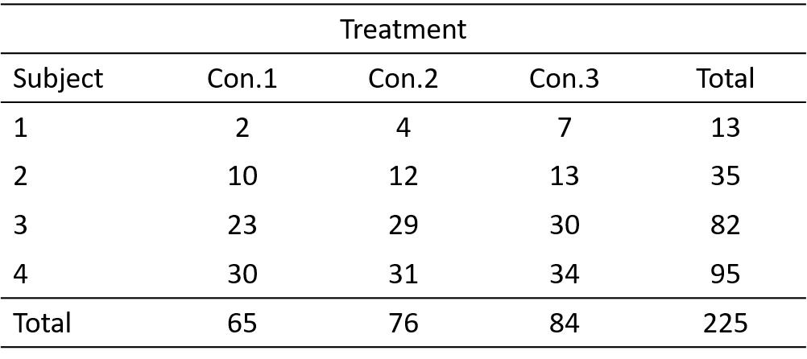
```

---
# Locating variance: An example
+ Consider the totals for the treatment effects.
+ They seem on average to be quite similar.

```{r, echo=FALSE, out.width="50%", fig.align='center'}
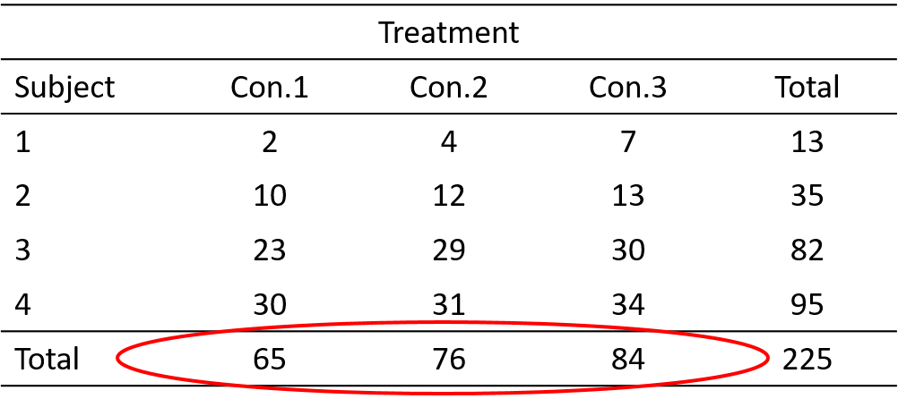
```


---
# Locating variance: An example
+ But there is a large amount of variability within treatments.
  + So we might think that the differences in total variation is just random
  + But that would not reflect the actual situation.

```{r, echo=FALSE, out.width="50%", fig.align='center'}
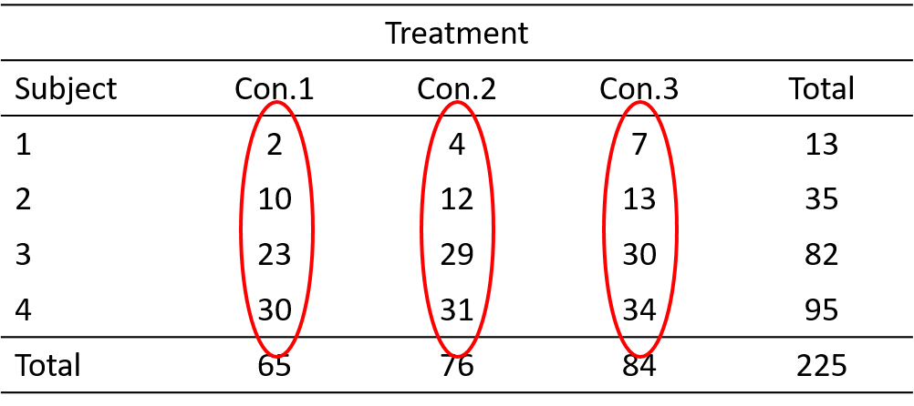
```


---
# Locating variance: An example
+ Look at the subject totals…
  + The variation within treatment condition is not the treatment, it is the individuals.
  + Subject 1 makes few errors across all conditions.
  + Subject 4 makes lots of errors across all conditions.

```{r, echo=FALSE, out.width="50%", fig.align='center'}
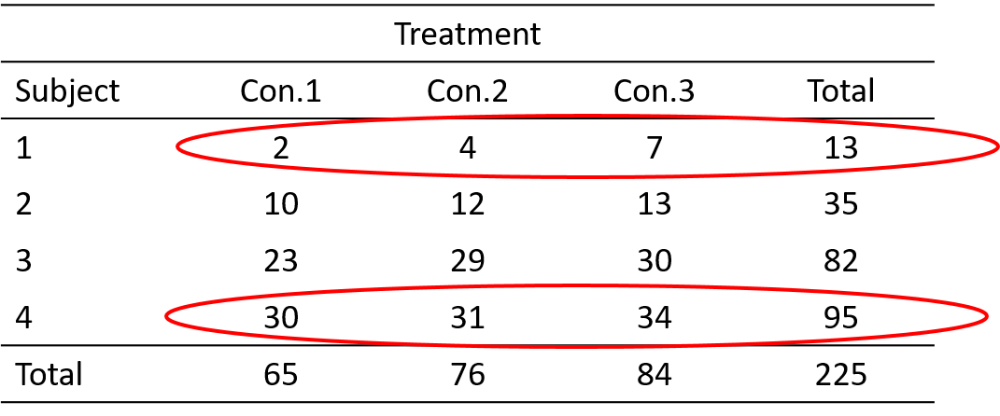
```


---
# Partitioning variance


```{r, echo=FALSE, out.width="75%", fig.align='center'}
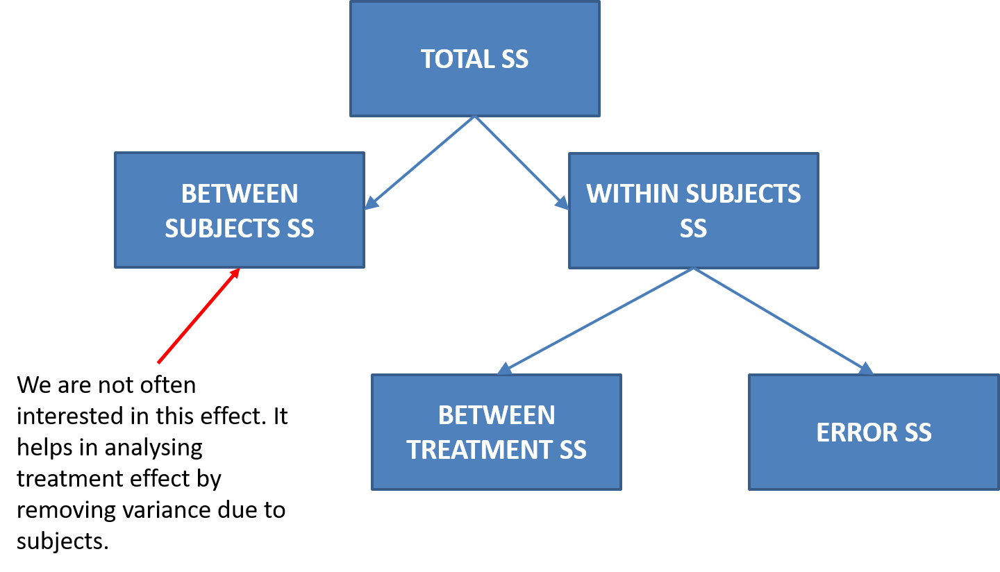
```


---
# Partitioning variance


```{r, echo=FALSE, out.width="75%", fig.align='center'}
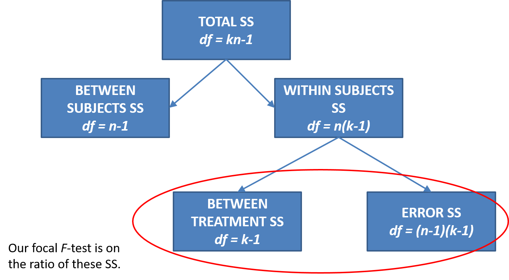
```

---
class: center, middle
# Time for a break

---
class: center, middle
# Welcome Back!

**Where we left off... **

---
# Why can't we use a linear model?

+ But Tom, you have been telling us it is all the same, are you a liar?
  + Well, I am not a liar, but things get a little more complicated.

+ Remember this:

$$y = \beta_0 + \beta_1 x + \epsilon$$
$$\text{where} \quad \epsilon \sim N(0, \sigma) \text{ independently}$$

+ **Assumption**: The errors ( $\epsilon$ ) are independent

---
# What violates independence?
+ We noted when talking about assumptions that independence is very much part of design.

+ Very clearly, in a repeated measures design our values (thus residuals) are not independent as multiple responses come from the same person.

+ This leads us to the idea of hierarchical data structure.


---
# Hierarchical structure

```{r, echo=FALSE, out.width="75%", fig.align='center'}
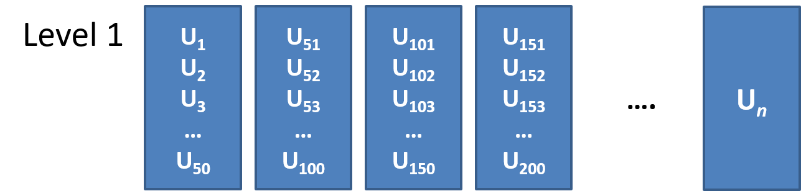
```

---
# Hierarchical structure

```{r, echo=FALSE, out.width="75%", fig.align='center'}
knitr::include_graphics("./figures/h2.png")
```

---
# Hierarchical structure

```{r, echo=FALSE, out.width="75%", fig.align='center'}
knitr::include_graphics("./figures/h3.png")
```

---
# Hierarchical structure

```{r, echo=FALSE, out.width="75%", fig.align='center'}
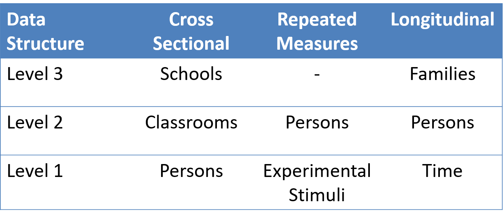
```

---
# Hierarchical structure

```{r, echo=FALSE, out.width="75%", fig.align='center'}
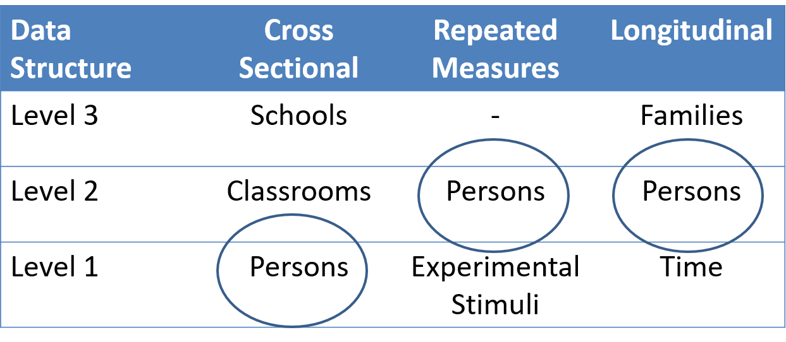
```

---
# Sources of structure

+ Repeated/longitudinal design

--

+ Family members
+ Social clusters
  + Workplaces
  + Schools
+ Other features of study design
  + sampling

---
# The linear model solution
+ Linear mixed effects models
  + Estimate models where the coefficients are allowed to vary by clustering/grouping variable.

+ So for each effect, we can have a:
  + **Fixed** part: average across all units
  + **Random** part: variance component capturing how my deviation there is from average due to the clustering

+ Highly flexible and is able to deal with clustering and structure of any type.
  + We can share materials in semester 2 for those who are interested.


---
class: center, middle
# Time for a break

---
class: center, middle
# Welcome Back!

**Where we left off... **

---
# Repeated measure designs with ANOVA

+ We will focus on the simpler case of repeated measures designs analysed using ANOVA.

+ These designs can be:
  + One-way: A single condition with multiple levels that all participants complete.
  + Factorial: Multiple conditions with 2+ levels that all participants complete.
  + Mixed: Contain both within and between person conditions (look back to the intro to designs material)

---
# Focal Tests
+ Just like in previous weeks, we can test:
  + The overall effect of a condition (with F-tests)
  + Specific contrasts between levels of a condition
  + Interactions
  + Control for covariates/nuisance factors

---
# One-way Repeated Measures

```{r, echo=FALSE, out.width="75%", fig.align='center'}

```

---
# Factorial Repeated Measures
+ Here we have two (or more) factors with 2 or more levels.
  + All participants complete all tasks.

+ Basic data structure for the 2x2 (factors A and B): 

```{r, echo=FALSE, out.width="70%", fig.align='center'}
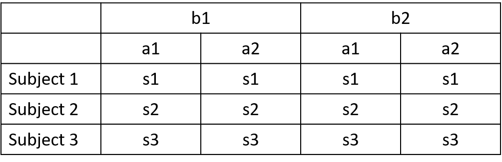
```

---
# Factorial Repeated Measures

```{r, echo=FALSE, out.width="70%", fig.align='center'}
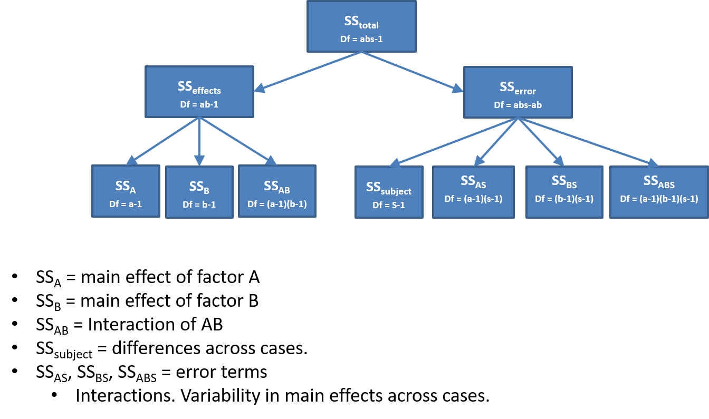
```

---
# Factorial Repeated Measures

```{r, echo=FALSE, out.width="70%", fig.align='center'}
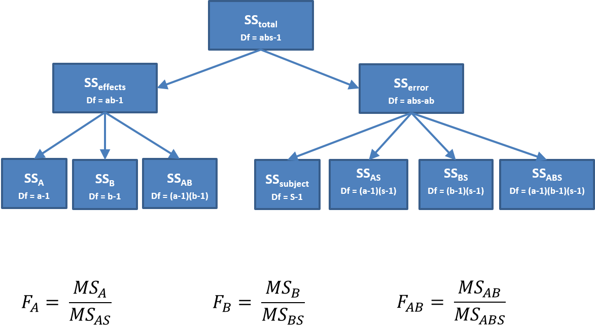
```

---
# Mixed Design

+ In mixed designs, we can combine repeated measures and between groups factors.
  + Individuals are randomly assigned to the between groups factors.
  + But all participants across the levels of the between groups factors provide data for all levels of the within group factor.

+ For example, imagine studying the effect of the fitness training regime across time.
  + Time is repeated measure
  + Fitness regime (none, running, rowing, swimming) is the between groups measure.
  + Lean body mass volume is DV

---
# Mixed Design

```{r, echo=FALSE, out.width="70%", fig.align='center'}
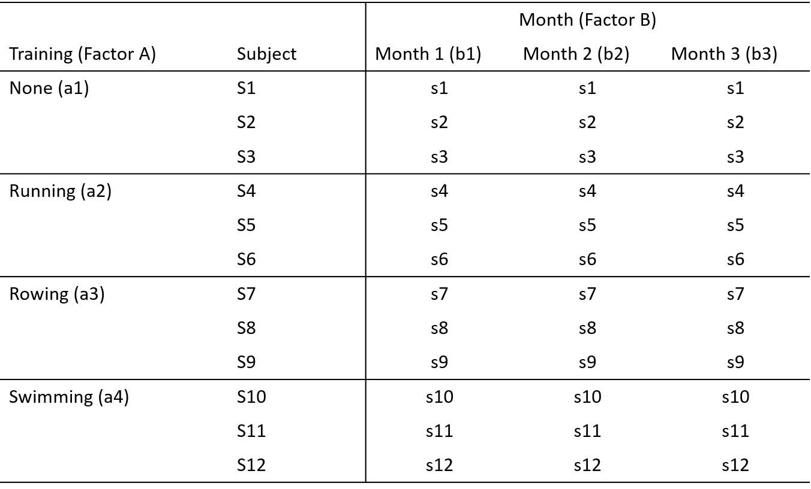
```

---
# Mixed Design

```{r, echo=FALSE, out.width="70%", fig.align='center'}
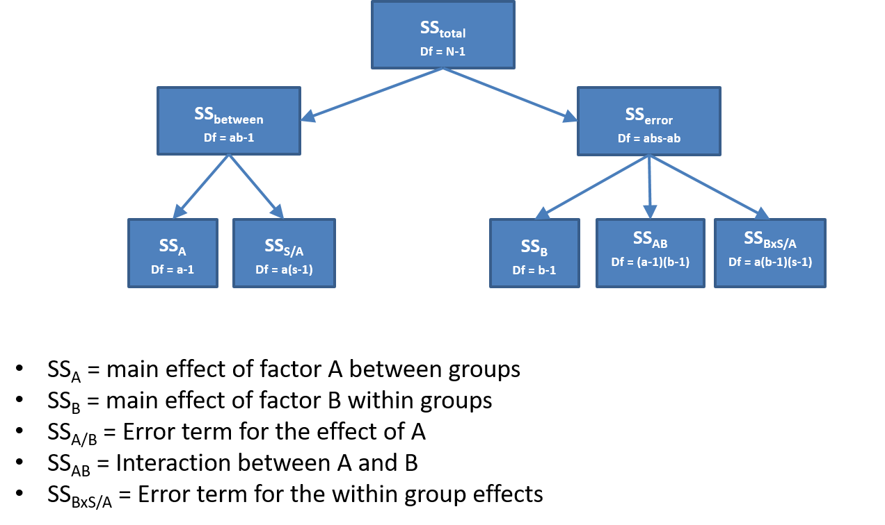
```


---
# Mixed Design

```{r, echo=FALSE, out.width="70%", fig.align='center'}
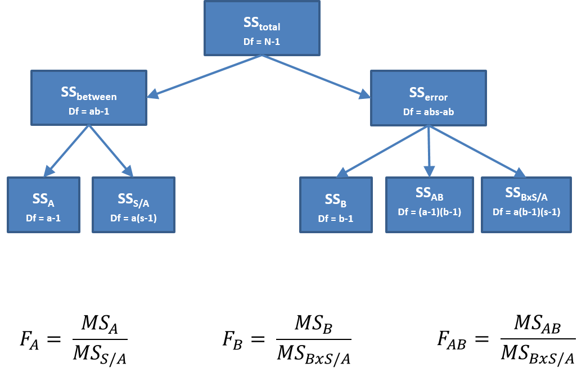
```

---
# Assumptions & Data Requirements
1. Outcome is measured at interval or ratio level. 
2. At least one predictor (condition) with 2+ levels for matched pairs or repeated measures.
3. No outliers
4. Approximate normality of the outcome with each level of the repeated condition
5. Sphericity (compound symmetry)

---
# Sphericity
+ **Compound symmetry**: 
  + Variances are equal across levels.
  + Covariances are equal across levels.
  + Variances and covariances to do not have to be equal to each other.

+ **Sphericity**:
  + Variances are equal across levels.
  + Variances of the differences of all pairs of levels are equal.

---
# Sphericity

```{r, echo=FALSE, out.width="50%", fig.align='center'}

```

---
# Sphericity
+ If sphericity is violated, then the F-ratio’s are inflated, increasing risk of Type I error.
+ The most common test for sphericity is Mauchly's test.
  + Null hypothesis that sphericity holds. 
  + Alternate it does not.

+ Test statistic = 1 when assumption holds
  + < 1 when it is violated
  + Further from 1, the greater the violation.

+ In small samples this test may not detect violations.

+ In large samples, it is known to be overly sensitive.


---
# Sphericity
+ If sphericity is violated, a number of options exist.

+ Each of these tests is a correction to the degrees of freedom of the F-test with the aim to reduce Type I error.
  + So in each case, the F-value stays the same.
  
+ Greenhouse-Geisser (1959):
  + More conservative, too conservative if Mauchley test statistic > .75

+ Huynh-Feldt (1976):
  + Less conservative

---
# In R
+ We are going to use the `ezANOVA` function for practical analysing repeated measure data.

+ The next recordings will be a work through of some of the basic syntax.
  + Lab will be further examples.


---
class: center, middle
# Time for a break

---
class: center, middle
# Welcome Back!

**Where we left off... **

---
# Sums of Squares
+ We have been talking a lot about sums of squares calculations.
  + Something we have held off discussing (until now) is that there are different types.

+ **Type I**: Sequential sums of squares
  + Effect of X on Y, holding all previous X constant
  + Order of variables into the model matters

+ **Type III**: Simultaneous sums of squares
  + Effect on X on Y holding all X constant
  + Order of variables into the model does not matter

+ Note: There are also type II sums of squares


---
# Example for SS
+ Let’s say we had three predictors of aggression:
  + Age ( $x_1$ )
  + Gender ( $x_2$ )
  + Anger-proneness ( $x_3$ )

+ In type I sums of squares:
  + The effect of age would be evaluated holding no other variables constant
  + The effect of gender would be evaluated holding age constant
  + The effect of anger-proneness would be evaluated holding age and gender constant

+ In type III sums of squares:
  + The effects of age, gender and anger-proneness would all be evaluated holding every other IV constant


---
# SS formally

$$y = \beta_0 + \beta_1 x_1 + \beta_2 x_2 + \beta_3 x_3 + \epsilon$$

.pull-left[
**Type I**

$$SS(\beta_1)$$
$$SS(\beta_2 | \beta_1)$$
$$SS(\beta_3 | \beta_1, \beta_2)$$

]

.pull-right[

**Type III**

$$SS(\beta_1 | \beta_2, \beta_3)$$
$$SS(\beta_2 | \beta_1, \beta_3)$$
$$SS(\beta_3 | \beta_1, \beta_2)$$
]

---
# SS Type I (sequential)

```{r, echo=FALSE, out.width="70%", fig.align='center'}
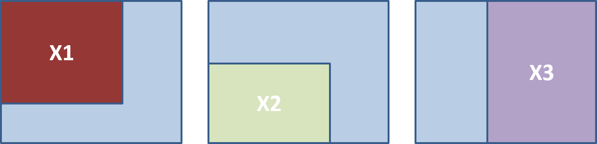
```

---
# SS Type I (sequential) x1

```{r, echo=FALSE, out.width="70%", fig.align='center'}
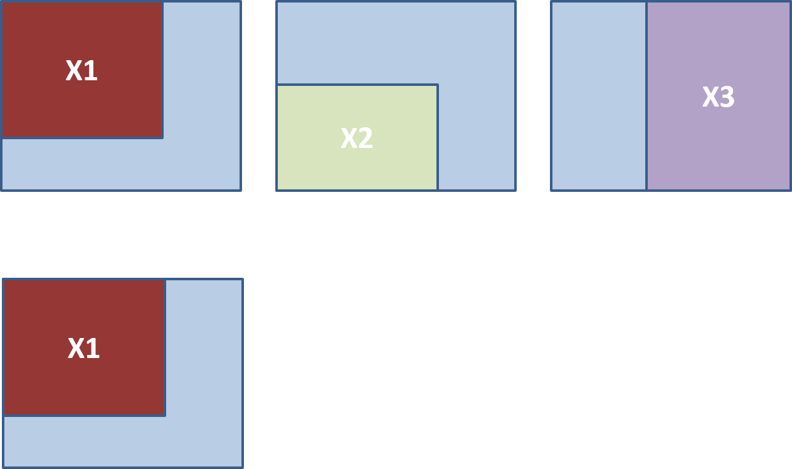
```

---
# SS Type I (sequential) x1

```{r, echo=FALSE, out.width="70%", fig.align='center'}
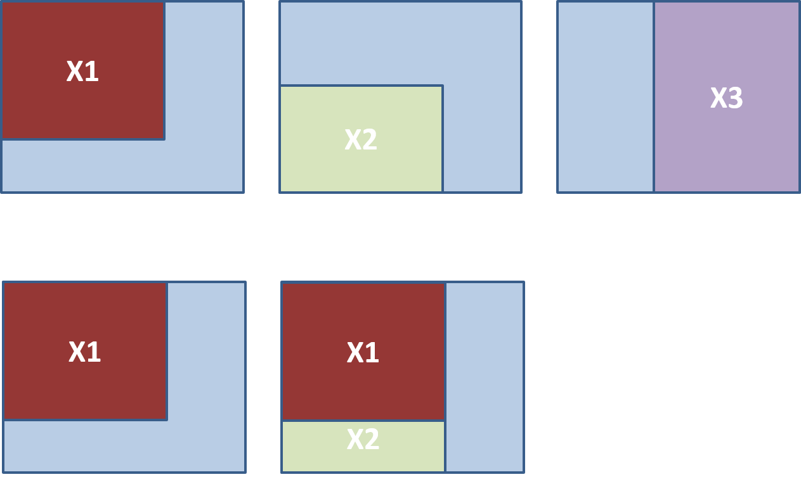
```

---
# SS Type I (sequential) x1

```{r, echo=FALSE, out.width="70%", fig.align='center'}
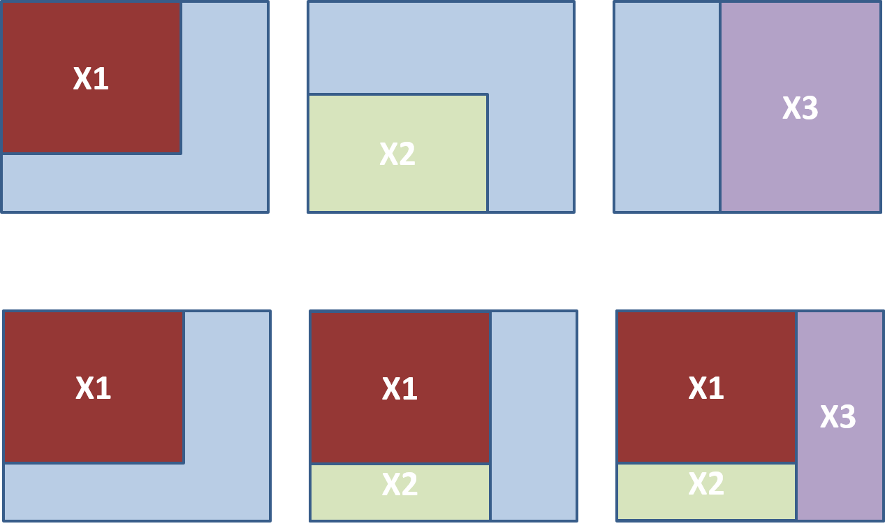
```

---
# SS Type I (sequential) x3

```{r, echo=FALSE, out.width="70%", fig.align='center'}
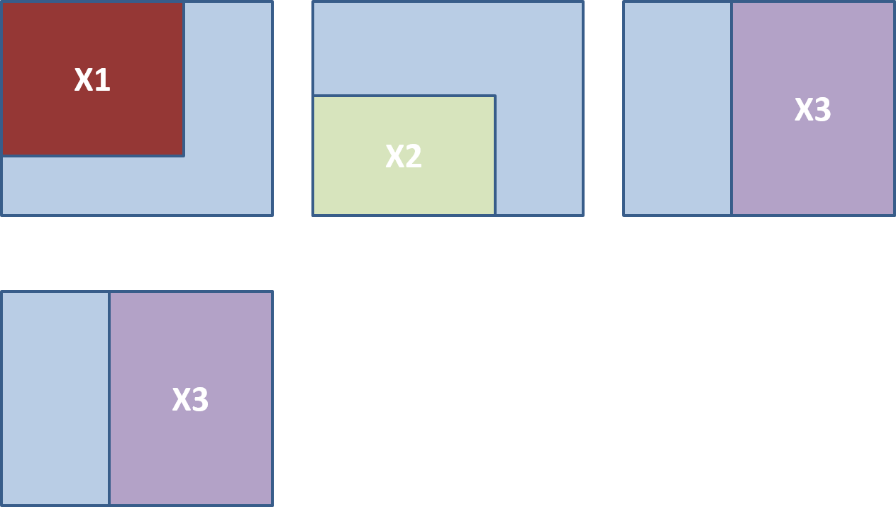
```

---
# SS Type I (sequential) x3

```{r, echo=FALSE, out.width="70%", fig.align='center'}
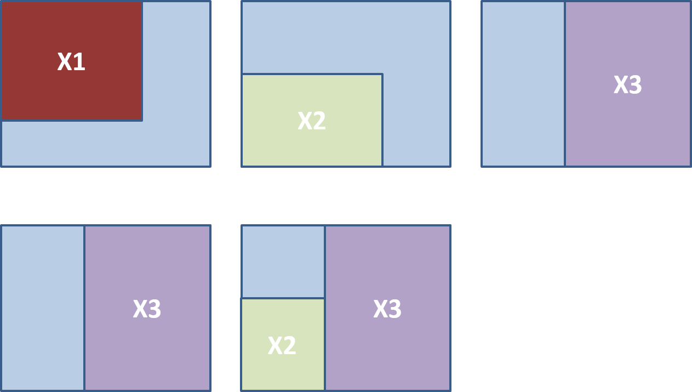
```

---
# SS Type I (sequential) x3

```{r, echo=FALSE, out.width="70%", fig.align='center'}
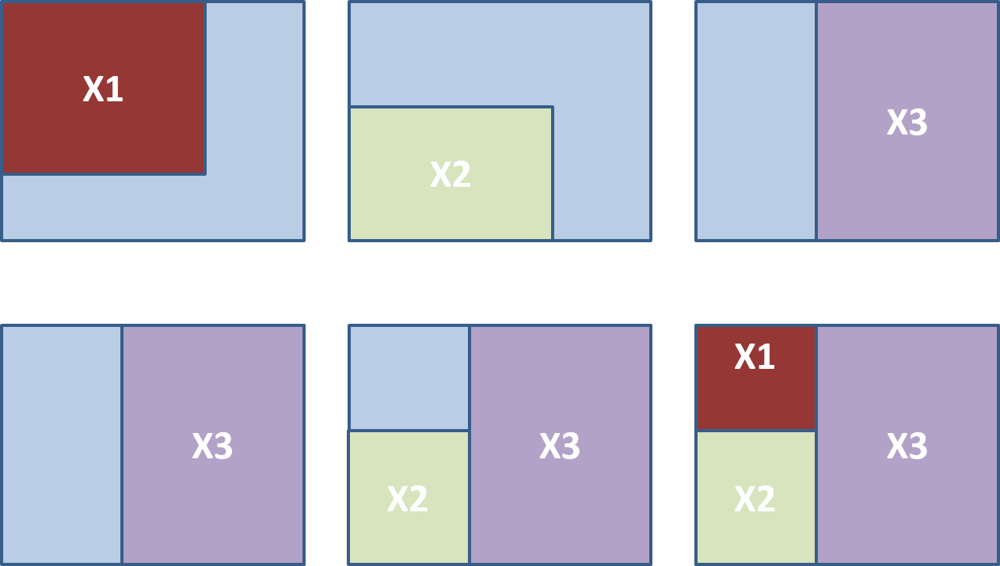
```

---
# SS Type I (sequential)
+ Comparison

```{r, echo=FALSE, out.width="70%", fig.align='center'}
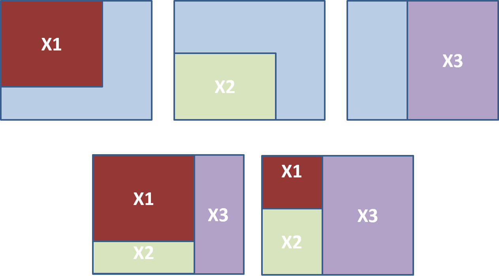
```

---
# SS Type III (simultaneous)

```{r, echo=FALSE, out.width="70%", fig.align='center'}
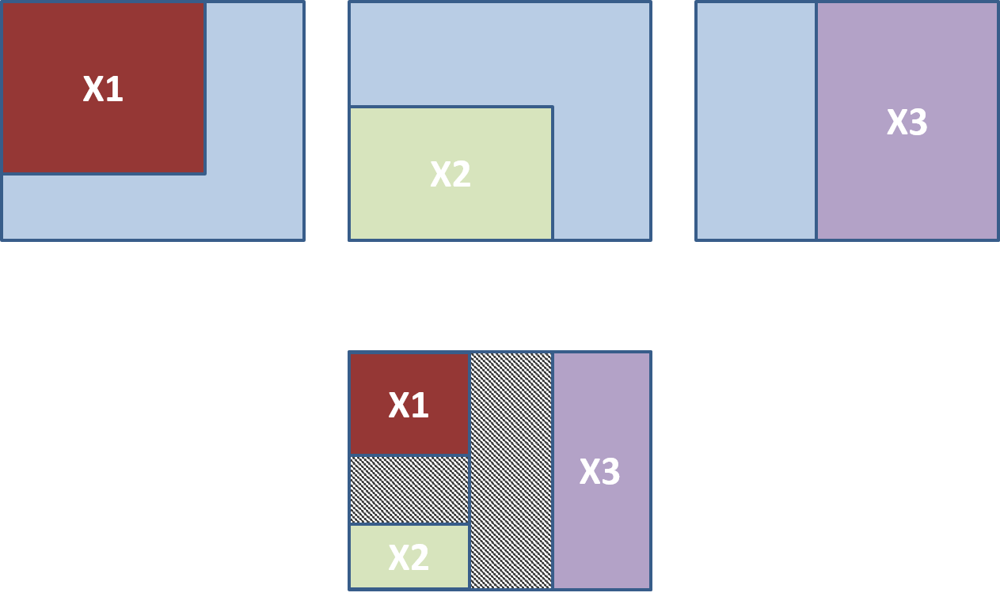
```


---
# Equivalent SS

+ If **all predictors are uncorrelated** Type I and Type III sums of squares provide the significance tests.

```{r, echo=FALSE, out.width="70%", fig.align='center'}
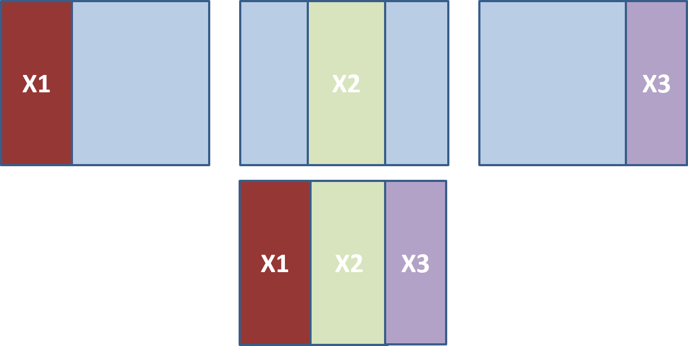
```

---
# SS in R
+ `lm` uses Type III sums of squares

+ `anova` uses Type I sums of squares

+ `ezANOVA` (and some other packages) you can specify

---
# Summary
+ Overview repeated measures designs
+ Consider the logic and strengths of the approach
+ Briefly summarised the issues of data clustering
  + And why here we have not looked at a full linear model approach.
+ Practically looked at examples of analysing models using `ezANOVA`
+ Recapped on assumptions and assumption violations
+ Finally, dealt with the nuance of Type I and Type III sums of squares

+ Next time, we will be moving on to something different.
  + Surveys and factor analysis