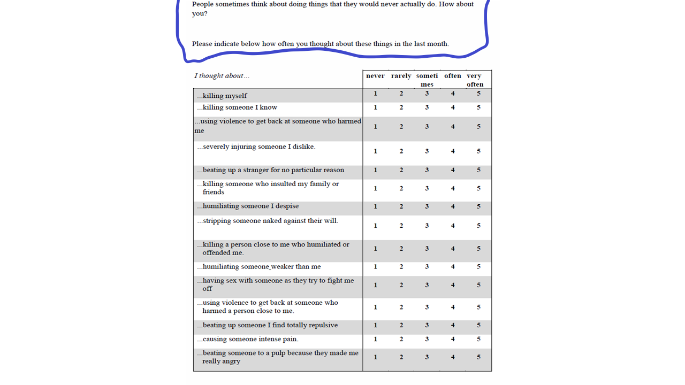
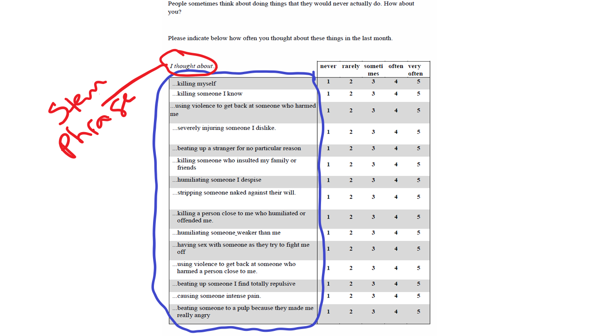
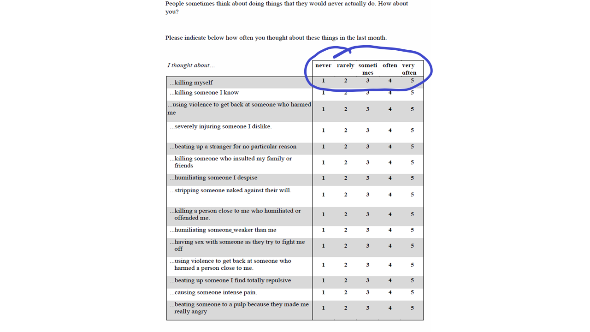
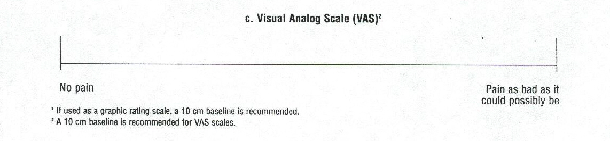
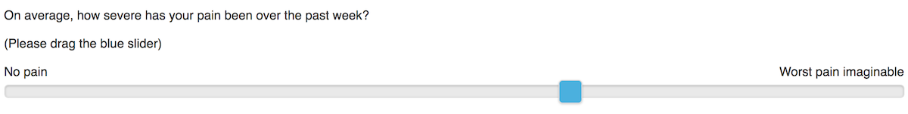
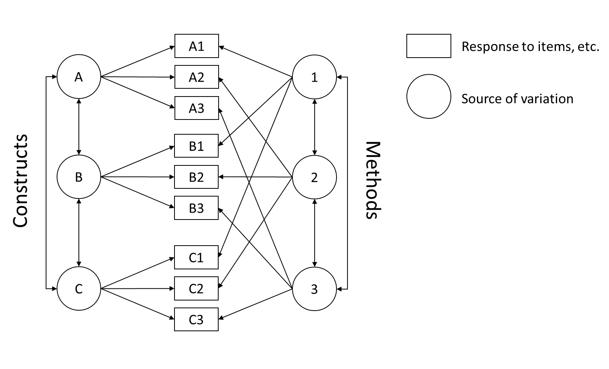

```{r setup, include=FALSE}
options(htmltools.dir.version = FALSE)
```

```{r xaringan-themer, include = FALSE}
library(xaringanthemer)
style_mono_accent(
  # base_color = "#0F4C81", # DAPR1
   base_color = "#BF1932", # DAPR2
  # base_color = "#88B05B", # DAPR3
  # base_color = "#FCBB06", # USMR
  # base_color = "#a41ae4", # MSMR
  header_color = "#000000",
  header_font_google = google_font("Source Sans Pro"),
  header_font_weight = 400,
  text_font_google = google_font("Source Sans Pro", "400", "400i", "600", "600i"),
  code_font_google = google_font("Source Code Pro"),
  text_font_size="1.3rem"
)
```

```{r, echo=FALSE, warning=FALSE, message=FALSE}

#knitr::opts_chunk$set(fig.retina = 1.5, out.width = '90%')

```

# 'Roadmap' for this part of the course

+ Lecture 1: Questionnaire design (creating a 'first draft')
+ Lecture 2: Polishing your draft using principal components analysis
+ Lecture 3: Polishing your draft using exploratory factor analysis
+ Lecture 4: The reliability and validity of your measures

---

# Today's topics

+ Brief definition of survey research
+ With regards to creating a first draft of a questionnaire, we will discuss:
  + Defining the construct or constructs
	+ Components of a questionnaire
		+ Instructions
		+ Item generation
		+ Response format
	+ Other considerations

---

# Survey research

+ Method of data collection
  + Large scale (many, many participants)
  + Linked to specific sampling strategy
  + Questions with limited response options
  + Very common across the social sciences
  + Used to measure mental states, opinions, experiences, behaviors,
    etc.
+ Different administration formats
  + Online versus paper-and-pencil
  + Postal versus telephone versus face-to-face (in person)

---
  
# Questionnaires

+ A lot of psychological research has used questionnaires
  + Questionnaires are not strictly surveys
  + "Survey" is usually used in a broader sense across the social sciences
  + They are probably mixed up at times because they have similar
    properties when it comes to how data gathered from each are
    analyzed.

---

# Questionnaires in psychology
+ Often developed to measure things, such as mental states or traits
  + These psychological **constructs** differ from physical attributes
  because they cannot be measured directly (yet)
  + Questionnaires in this sense are often referred to as
    *psychometric measures*
+ The development of questionnaires is one of psychology's unheralded
  success stories
  + Psychologists can measure seemingly ephemeral things like
  intelligence, personality, and mood really well
  + Studies using these data are among the most replicable findings in
  psychology

---

# Developing your questionnaire
1. Define your construct or constructs (ideally based on literature)
2. Create a questionnaire (the first draft)
3. Collect data
4. Analyze data using principal components analysis or factor
   analysis
5. Lather, rinse, repeat

---

# Construct definition
+ What are you trying to measure?
+ Is what you're trying to measure different or the same as other
  constructs?
+ Are there different parts of the construct?
  + Another way to ask this is whether the construct is
    multidimensional?
  + Is so, you need to think about the hierarchical
    **structure** of the construct
		+ Personality structure: five mostly uncorrelated domains 
		+ Intelligence structure: multiple highly correlated domains

---

# Five parts of a questionnaire
1. Length and structure (two, really, but they're related)
2. The instructions
3. The items
4. Response format
5. Scoring

---
# Length and structure
+ Length (number of items and detail of instructions) is a balancing
  act  
  + If the questionnaire is too long, participants can get bored and
  frustrated
  + If the questionnaire is too short, there will be inadequate
  coverage of your constructs [\(see, e.g., Weiss & Costa,
  2014\)](https://academic.oup.com/aje/article/179/6/791/107396)
+ Structure
  + How many constructs do you wish to measure?
  + What is the dimensionality of each construct?
+ Note: the more dimensions and constructs, the longer the
  questionnaire will be
  + NEO-PI-3 which measures 5 personality domains and 6 facets for
    each domain (35 constructs) is 240 items long
  + NEO-FFI which measures 5 personality domains (5 constructs) is 60
    items long
	
---

# The instructions
+ Should be the first thing the participant sees
+ Should include:
  + A brief background on the construct or constructs
  + Information on how to respond
	+ The wording is important, especially so for sensitive
      topics!
	+ Wording can also be used to contextualize or prime responses
		+ "How often have you done the following in the past
          [day/week/month/year/etc.]?"
		+ "Have you done the following more often than your peers?"

---



---

# The items
+ First, define your construct or constructs
+ Next, write items that reflect those definitions
  + Write **many** more items than you think will be used
	+ Data reduction (and other screening) will identify some items as being
      bad
	+ Sometimes bad items will be items that you thought would be good
	+ Items that are bad will often be bad for reasons that you did
      not anticipate
	+ If you decide to use a "stem" word or phrase, make sure the
      completed sentence is grammatical

---



---

# Examples of bad items
+ Wouldn't you agree that coffee is healthy?
  + Leading
+ Do you regularly steal teaspoons?
  + Vague ("Regularly"), too specific ("steal teaspoons"), ethically
    dubious
+ I like to have fun.
  + Vague
+ Do you suffer from psychopathic personality disorder?
  + Too specific
+ Do you enjoy parties and going to the cinema?
  + Double-barralled
+ Hunting foxes should not be prohibited
  + Contains double-negative

---

# Beware of dangling participles when writing items
+ Dangling participles confuse readers
  + "After committing the murder, the judge sentenced the defendant to
  life in prison."
  + Who committed the murder?

---

# Response format
+ Likert-type scales
  + Often used in personality or well-being questionnaires
  + You need to decide how many response options, what are the verbal
    labels, whether to include a "middle" response, and "direction" of
    responses. These decisions **can** be influential
	  + NEO-PI-3: strongly disagree, disagree, neutral, agree,
      strongly agree
	  + Midlife Developmental Inventory: a lot, some, a little, not at
      all
	  + Minnesota Multiphasic Personality Inventory: yes, no, ?

---



---

# Response format
+ Visual analogue scales 
  + Often used to perceived pain, temperature, etc.
	+ Paper-and-pencil versions involves asking participants to put
      mark at point in a line of some specified length
	+ Computer-administered versions asks participants to move a slider
+ **WARNING**
  + These scales can give a false impression of how precise a measure
  is
  + This risk is probably greater for psychological constructs

---



---



---

# Response format
+ Open-ended questions (e.g., text boxes)
  + Can be used to get supplementary information
  + Requires coding and evaluation (think back to qualitative methods)
  
---

# Scoring
+ How do you summarize the items?
  + Simplest way is to sum items for each construct or take an average
	+ You will often need to reverse-code some items
		+ "I often feel happy" + "I often feel sad" makes little sense
		+ Have to reverse one or the other item
	+ Don't forget to think about levels of measurement

---

# Other considerations
+ How survey design can influence responding
+ Cognitive aspects of survey methods
+ Response styles

---
# Cognitive aspects
+ Work by Tourangeau, Rips, and Rasinski (summarized in their 2000
  book)
  + Focuses on process of responding to surveys
  + Consider the following quote:

    > It depends on what the meaning of the word "is" is. If the--if he--if
    > "is" means is and never has been, that is not--that is one thing. If
    > it means there is none, that was a completely true statement....Now,
    > if someone had asked me on that day, are you having any kind of sexual
    > relations with Ms. Lewinsky, that is, asked me a question in the
    > present tense, I would have said no. And it would have been completely
    > true.

William J. Clinton cited in Starr, K. W. (1998). *Referral from
Independent Counsel Kenneth W. Starr in conformity with the
requirement of Title 28, United States Code, Section 595(c)*, footnote
1,198.

---

# Sequence of steps when completing surveys (Tourangeau et al., 2000)
1. Comprehension
2. Retrieval
3. Judgement
4. Response

---

# Comprehension
1. Attend to questions and instructions
2. Present logical form of question
3. Identify question focus (intended information
4. Link key terms to concepts

---
# Retrieval
1. Generate retrieval strategy and cues
2. Retrieve specific and generic memories
3. Fill in the missing details

---

# Judgement
1. Assess completeness and relevance of memories
2. Draw inferences based on accessibility of information
3. Integrate the retrieved information
4. Make estimates for partial retrieval

---
# Response
1. Map judgement onto response categories
2. Edit response

---

# Consider these steps with a "simple" item
+ In the last 12 months, how many times have you made independent
  visits to a doctor?

---

# The sort of item you'd find in a psychology study

Instructions: 

Describe yourself as you generally are now, not as you wish to be in
the future. Describe yourself as you honestly see yourself, in
relation to other people you know of the same sex as you are, and
roughly your same age.

1. I am the life of the party.

| Very Inaccurate | Moderately Inaccurate | Neither Accurate nor Inaccurate | Moderately Accurate | Very Accurate |
|:---------------:|:---------------------:|:-------------------------------:|:-------------------:|:-------------:|
| o               | o                     | o                               | o                   | o             |

---

# What if that item was ...

Instructions: 

Describe yourself as you generally are now, not as you wish to be in
the future. Describe yourself as you honestly see yourself, in
relation to other people you know of the same sex as you are, and
roughly your same age.

1. I am the life of the party.

| True | False |
|:----:|:-----:|
|  o   |   o   |

---

# Things that influence how items are processed
+ Features of items
  + Social desirability
  + Demand characteristics
  + Ambiguity
  + Common scale formats
  + Common scale anchors
  + Positive and negative wording
+ Features of questionnaire structure and design
  + Item priming
  + Item embeddedness
  + Scale length
  + Context-induced mood (think sensitive questions)
+ 2003 paper by Podsakoff et al. provides many more!

---

# Implications
+ Good surveys are hard to design
  + Many guides don't discuss these things in depth
  + Many surveys are badly designed
+ Responding to surveys is a complex, burdensome task
+ Respondents often rely on heuristic or biased response strategies

---

# Biased responding
+ Response biases
  + Ways people provide distorted responses
  + Can do so knowingly or not knowingly
	+ Mischievous responding: responding in silly ways
	+ Can be detected by examining responses to nonsense items, e.g.,
      "Elvis works at my Tesco."
+ Social desirability
  + Leniency bias
  + Acquiescence

---

# Method effects
+ Three reasons items may be correlated
  + Both measure the same construct (share trait variance)
	  + I enjoy talking to people
	  + People think I'm "warm"
   + They have common methodological features (share method variance)
		+ I **often feel** nervous
		+ I **often feel** time pressured
   + They share trait *and* method variance
	   + I enjoy **parties**
	   + At **parties**, I am the center of attention

---



---

# Linking these things together
+ Certain biases may be more likely to occur at different stages of
  the cognitive model
  + Comprehension = ambiguities
  + Response selection = item format issues
  + Response reporting = response biases
