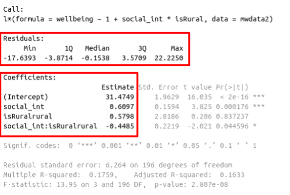

```{r setup, include=FALSE}
source('assets/setup.R')

set.seed(953)
```

:::green
Be sure to check the [**solutions to last week's exercises**](03_mlr_int.html).<br>You can still ask any questions about previous weeks' materials if things aren't clear!
:::


# Refresher: LM assumptions 

:::frame  
In the previous labs, we have fitted a number of multiple regression models. In each case, we first specified the model, then visually explored the marginal distributions and relationships of variables which would be used in the analysis. Finally, we fit the model, and began to examine the fit by studying what the various parameter estimates represented, and the spread of the residuals (the parts of the output inside the red boxes in Figure \@ref(fig:mlroutput)) 

```{r mlroutput, echo=FALSE, fig.cap="Multiple regression output in R, summary.lm(). Residuals and Coefficients highlighted"}

```

You will recall that **before** we draw inferences using our model estimates or use our model to make predictions, we need to be satisfied that our model meets the set of assumptions.  

:::red
All of the estimates, intervals and hypothesis tests (see Figure \@ref(fig:mlroutputhyp)) resulting from a regression analysis _assume_ a certain set of conditions have been met. Meeting these conditions is what allows us to generalise our findings beyond our sample (i.e., to the population).  
```{r mlroutputhyp, echo=FALSE, fig.cap="Multiple regression output in R, summary.lm(). Hypothesis tests highlighted"}
knitr::include_graphics("images/mlrhyp.png")
```
:::

Recall the assumptions of the linear model: 

+ **L**inearity: The relationship between $y$ and $x$ is linear.
+ **I**ndependence of errors: The error terms should be independent from one another.
+ **N**ormality: The errors $\epsilon$ are normally distributed
+ **E**qual variances ("Homoscedasticity"): The scale of the variability of the errors  $\epsilon$ is constant at all values of $x$.  

When we fit a model, we evaluate many of these assumptions by looking at the residuals (the deviations from the observed values $y_i$ and the model estimated value $\hat y_i$). The residuals, $\hat \epsilon$ are our estimates of the actual unknown true error term $\epsilon$.  
Because these same assumptions hold for a regression model with multiple predictors, we can assess them in a similar way. However, there are a number of important considerations. 

:::

`r qbegin(1)`
Open a new RMarkdown document. Copy the code below to load in the tidyverse packages, read in the wellbeing.csv data and fit the following model:  

$$ 
\text{Wellbeing} = \beta_0 + \beta_1 \cdot \text{Outdoor Time} + \beta_2 \cdot \text{Social Interactions} + \epsilon
$$

```{r}
library(tidyverse) 

# read in the wellbeing data
mwdata = read_csv(file = "https://uoepsy.github.io/data/wellbeing.csv")
# fit the linear model: 
wb_mdl1 <- lm(wellbeing ~ outdoor_time + social_int, data = mwdata)
```

**Note:** We have have forgone writing the `1` in `lm(y ~ 1 + x...`. The 1 just tells R that we want to estimate the Intercept, and it will do this by default even if we leave it out. 
`r qend()`

# Guided exercises  

## Linearity  
:::frame
In simple linear regression (SLR) with only one explanatory variable, we could assess linearity through a simple scatterplot of the outcome variable against the explanatory. In multiple regression, however, it becomes more necessary to rely on diagnostic plots of the model residuals. This is because we need to know whether the relations are linear between the outcome and each predictor _after accounting for the other predictors in the model._  

In order to assess this, we use **partial-residual plots** (also known as 'component-residual plots'). This is a plot with each explanatory variable $x_j$ on the x-axis, and **partial residuals** on the y-axis.

Partial residuals for a predictor $x_j$ are calculated as:
$$
\hat \epsilon + \hat \beta_j x_j
$$

**In R** we can easily create these plots for all predictors in the model by using the `crPlots()` function from the **car** package.  
:::

`r qbegin(2)`
Create partial-residual plots for the `wb_mdl1` model.  
Remember to load the **car** package first. If it does not load correctly, it might mean that you have need to install it.  

Write a sentence summarising whether or not you consider the assumption to have been met. Justify your answer with reference to the plots.
`r qend()`
`r solbegin(show=params$SHOW_SOLS, toggle=params$TOGGLE)`
```{r}
library(car)
crPlots(wb_mdl1)
```

:::int
The smoother (the pink line) follows quite closely to a linear relationship (the dashed blue line), suggesting that the linearity assumption is met.  
:::

`r solend()`

## Equal variances (Homoscedasticity)  
:::frame
The equal variances assumption is that the error variance $\sigma^2$ is constant across values of the predictors $x_1$, ... $x_k$, and across values of the fitted values $\hat y$. This sometimes gets termed "Constant" vs "Non-constant" variance. Figures \@ref(fig:ncv1) & \@ref(fig:ncv2) shows what these look like visually. 

```{r ncv1, echo=FALSE, fig.cap="Non-constant variance for numeric and categorical x"}
library(patchwork)
n=1000
x <- runif(n, min = 0, max = 100)
y.increasing <- 3 + 0.2 * x + (1 + x / 25) * rnorm(n, sd = 3)
y.good <- 3 + 0.1 * x + rnorm(n, sd = 3)


lm.good <- lm(y.good ~ x)
lm.bad <-lm(y.increasing~x)

p1<-ggplot(NULL, aes(x=fitted(lm.bad), y=resid(lm.bad)))+
  geom_point(shape=1)+
  labs(title="Non-constant variance",subtitle="ncvTest p<.05",x="fitted",y="residuals")+
  theme(axis.text = element_blank())

p2<-ggplot(NULL, aes(x=fitted(lm.good), y=resid(lm.good)))+
  geom_point(shape=1)+
  labs(title="constant variance",subtitle="ncvTest p>.05",x="fitted",y="residuals")+
  theme(axis.text = element_blank())

p3<-ggplot(NULL, aes(x=fitted(lm.bad)<mean(fitted(lm.bad)), y=resid(lm.bad)))+
  geom_point(shape=1)+
  labs(x="fitted",y="residuals")+
  theme(axis.text = element_blank())

p4<-ggplot(NULL, aes(x=fitted(lm.good)<mean(fitted(lm.good)), y=resid(lm.good)))+
  geom_point(shape=1)+
  labs(x="fitted",y="residuals")+
  theme(axis.text = element_blank())


(p1 | p3 )
```

```{r ncv2, echo=FALSE, fig.cap="Constant variance for numeric and categorical x"}
(p2 | p4)
```

**In R** we can create plots of the _Pearson residuals_ against the predicted values $\hat y$ and against the predictors $x_1$, ... $x_k$ by using the `residualPlots()` function from the **car** package. This function also provides the results of a lack-of-fit test for each of these relationships (note when it is the fitted values $\hat y$ it gets called "Tukey's test").  

`ncvTest(model)` (also from the **car** package) performs a test against the alternative hypothesis that the error variance changes with the level of the fitted value (also known as the "Breusch-Pagan test"). $p >.05$ indicates that we do _not_ have evidence that the assumption has been violated.
:::

`r qbegin(3)`
Use `residualPlots()` to plot residuals against each predictor, and use `ncvTest()` to perform a test against the alternative hypothesis that the error variance changes with the level of the fitted value.  

Write a sentence summarising whether or not you consider the assumption to have been met. Justify your answer with reference to plots and/or formal tests where available.
`r qend()`
`r solbegin(show=params$SHOW_SOLS, toggle=params$TOGGLE)`
```{r}
residualPlots(wb_mdl1)

#test against the alternative hypothesis that error variance changes with level of fitted value
ncvTest(wb_mdl1)
```

:::int
Partial residual plots show no clear non-linear trends between residuals and predictors.
Visual inspection of suggested little sign of non-constant variance, with the Breusch-Pagan test failing to reject the null that error varance does not change across the fitted values ($\chi^2(1)=0.002$, $p = .965$).
:::

`r solend()`

`r qbegin(4)`
Create the "residuals vs. fitted plot" - a scatterplot with the residuals $\hat \epsilon$ on the y-axis and the fitted values $\hat y$ on the x-axis.  
<br>
You can either do this: 

a. manually, using the functions `residuals()` and `fitted()`, or 
b. quickly by giving the `plot()` function your model. Be sure to specify which plot you want to return - e.g., `plot(wb_mdl1, which = ???)`

You can use this plot to visually assess:  

+ **L**inearity: Does the average of the residuals $\hat \epsilon$ remain close to 0 across the plot?  
+ **E**qual Variance: does the spread of the residuals $\hat \epsilon$ remain constant across the predicted values $\hat y$?  

`r qend()`
`r solbegin(show=params$SHOW_SOLS, toggle=params$TOGGLE)`
The long way:
```{r}
# Notice that we create a tibble and pass it directly to ggplot()
# using the %>%.
# This means we don't have to store it as an object in the environment,
# it is just being used to create the plot
tibble(
  residuals = residuals(wb_mdl1),
  fitted = fitted(wb_mdl1)
) %>% 
  ggplot(aes(x = fitted, y = residuals)) + 
  geom_point() + 
  geom_smooth(color="red",se=FALSE)
```

The quick way:
```{r}
plot(wb_mdl1, which=1)
```

:::int
The horizontal red line shows that the average of the residual remains close to zero across the fitted values.  
The spread of the residuals remains reasonably constant across the fitted values. 
:::

`r solend()`

## Independence
:::frame
The "independence of errors" assumption is the condition that the errors do not have some underlying relationship which is causing them to influence one another. 
<br>
There are many sources of possible dependence, and often these are issues of study design. For example, we may have groups of observations in our data which we would expect to be related (e.g., multiple trials from the same participant). Our modelling strategy would need to take this into account.
<br>
One form of dependence is **autocorrelation** - this is when observations influence those adjacent to them. It is common in data for which *time* is a variable of interest (e.g, the humidity today is dependent upon the rainfall yesterday).  
<br>
**In R** we can test against the alternative hypothesis that there is autocorrelation in our errors using the `durbinWatsonTest()` (an abbreviated function `dwt()` is also available) in the **car** package.  

:::

`r qbegin(5)`
Perform a test against the alternative hypothesis that there is autocorrelation in the error terms.  
  
Write a sentence summarising whether or not you consider the assumption of independence to have been met (you may have to assume certain aspects of the study design).  
`r qend()`
`r solbegin(show=params$SHOW_SOLS, toggle=params$TOGGLE)`
```{r}
dwt(wb_mdl1)
```

:::int
A Durbin-Watson test of autocorrelation failed to reject the null hypothesis that there was no serial dependence in the error ($DW = 2.6$, $p = .138$). We will also assume that observations to be randomly sampled during study recruitment. 
:::

`r solend()`

## Normality of errors  
:::frame
The normality assumption is the condition that the errors $\epsilon$ are normally distributed. 

We can visually assess this condition through histograms, density plots, and quantile-quantile plots (QQplots) of our residuals $\hat \epsilon$.    
We can also perform a Shapiro-Wilk test against the alternative hypothesis that the residuals were not sampled from a normally distributed population. The `shapiro.test()` function in R. 

:::

`r qbegin(6)`
Assess the normality assumption by producing a qqplot of the residuals (either manually or using `plot(model, which = ???)`), and conducting a Shapiro-Wilk test.  
  
Write a sentence summarising whether or not you consider the assumption to have been met. Justify your answer with reference to plots and/or formal tests where available.
`r qend()`
`r solbegin(show=params$SHOW_SOLS, toggle=params$TOGGLE)`
We can get the QQplot from one of the `plot(model)` plots: 
```{r}
plot(wb_mdl1, which = 2)
```
Or we can make our own:
```{r}
tibble(
  resids = residuals(wb_mdl1)
) %>% ggplot(aes(sample=resids))+
  geom_qq()+
  geom_qq_line()
```

```{r}
shapiro.test(residuals(wb_mdl1))
```

:::int 
The QQplot indicates that the residuals follow close to a normal distribution, although with evidence of heavier tails. A Shapiro-Wilk test failed to reject the null hypothesis that the residuals were drawn from a normally distributed population ($W = 0.95$, $p = .129$)
:::

`r solend()`

## Multicollinearity  
:::frame
For the linear model with multiple explanatory variables, we need to also think about **multicollinearity** - this is when two (or more) of the predictors in our regression model are moderately or highly correlated.  
Recall our interpretation of multiple regression coefficients as  
<center>"the effect of $x_1$ on $y$ when _holding the values of $x_2$, $x_3$, ... $x_k$ constant_"</center>  
This interpretation falls down if predictors are highly correlated because if, e.g., predictors $x_1$ and $x_2$ are highly correlated, then changing the value of $x_1$ necessarily entails a change the value of $x_2$ meaning that it no longer makes sense to talk about _holding $x_2$ constant._  
<br>
We can assess multicollinearity using the **variance inflation factor (VIF)**, which for a given predictor $x_j$ is calculated as:  
$$
VIF_j = \frac{1}{1-R_j^2} \\
$$
Where $R_j^2$ is the coefficient of determination (the R-squared) resulting from a regression of $x_j$ on to all the other predictors in the model ($x_j = x_1 + ... x_k + \epsilon$).  
The more highly correlated $x_j$ is with other predictors, the bigger $R_j^2$ becomes, and thus the bigger $VIF_j$ becomes.  
<br>
The square root of VIF indicates how much the SE of the coefficient has been inflated due to multicollinearity. For example, if the VIF of a predictor variable were 4.6 ($\sqrt{4.6} = 2.1$), then the standard error of the coefficient of that predictor is 2.1 times larger than if the predictor had zero correlation with the other predictor variables. Suggested cut-offs for VIF are varied. Some suggest 10, others 5. Define what you will consider an acceptable value _prior_ to calculating it.   
<br>
**In R**, the `vif()` function from the **car** package will provide VIF values for each predictor in your model. 

:::


`r qbegin(7)`
Calculate the variance inflation factor (VIF) for the predictors in the model.  

Write a sentence summarising whether or not you consider multicollinearity to be a problem here.  
`r qend()`
`r solbegin(show=params$SHOW_SOLS, toggle=params$TOGGLE)`
```{r}
vif(wb_mdl1)
```

:::int
VIF values <5 indicate that multicollinearity is not adversely affecting model estimates. 
:::

`r solend()`

## Individual cases  

:::frame
We have seen in the case of the simple linear regression that individual cases in our data can influence our model more than others. We know about:  

+ **Regression outliers:** A large residual $\hat \epsilon_i$ - i.e., a big discrepancy between their predicted y-value and their observed y-value.  
    + **Standardised residuals:** For residual $\hat \epsilon_i$, divide by the estimate of the standard deviation of the residuals. In R, the `rstandard()` function will give you these
    + **Studentised residuals:** For residual $\hat \epsilon_i$, divide by the estimate of the standard deviation of the residuals excluding case $i$. In R, the `rstudent()` function will give you these.
+ **High leverage cases:** These are cases which have considerable _potential_ to influence the regression model (e.g., cases with an unusual combination of predictor values). 
    + **Hat values:** are used to assess leverage. In R, The `hatvalues()` function will retrieve these. 
+ **High influence cases:** When a case has high leverage *and* is an outlier, it will have a large influence on the regression model. 
    + **Cook's Distance:** combines *leverage* (hatvalues) with *outlying-ness* to capture influence. In R, the `cooks.distance()` function will provide these. 

:::

`r qbegin(8)`
Create a new tibble which contains:  

1. The original variables from the model (Hint, what does `wb_mdl1$model` give you?)
2. The fitted values from the model $\hat y$  
3. The residuals $\hat epsilon$
4. The studentised residuals
5. The hat values
6. The Cook's Distance values. 

`r qend()`
`r solbegin(show=params$SHOW_SOLS, toggle=params$TOGGLE)`

```{r}

mdl_diagnost <- 
  tibble(
  wb_mdl1$model,
  fitted = fitted(wb_mdl1),
  resid = residuals(wb_mdl1),
  studres = rstudent(wb_mdl1),
  hats = hatvalues(wb_mdl1),
  cooksd = cooks.distance(wb_mdl1)
)
```


`r solend()`

`r qbegin(9)`
Looking at the studentised residuals, are there any outliers?  
`r qend()`
`r solbegin(show=params$SHOW_SOLS, toggle=params$TOGGLE)`
Recall from the lectures, studentised residuals of $>2$ or $< -2$ indicate potential outlyingness.  

We can ask R whether the *absolute* values are $>2$:
```{r}
abs(mdl_diagnost$studres) > 2
```

We could *filter* our newly created tibble to these observations:
```{r}
mdl_diagnost %>% 
  filter(abs(studres)>2)
```
There are zero rows. 

`r solend()`

`r qbegin(10)`
Looking at the hat values, are there any observations with high leverage?  
`r qend()`
`r solbegin(show=params$SHOW_SOLS, toggle=params$TOGGLE)`
Recall from the lectures, hat values of more than $2 \bar{h}$ (2 times the average hat value) are considered high leverage.  

The average hat value, $\bar{h}$ is calculated as $\frac{k + 1}{n}$, where $k$ is the number of predictors, and $n$ is the sample size. 
For our model:
$$
\bar h = \frac{k+1}{n} = \frac{2+1}{32} = \frac{3}{32} = 0.094
$$

We can ask whether any of observations have hat values which are greater than $\bar h$:

```{r}
mdl_diagnost %>%
  filter(hats > (2*0.094))
```

Note that `r sum(mdl_diagnost$hats > (2*0.094))` observations have high leverage. 

`r solend()`
  
`r qbegin(11)`
Looking at the Cook's Distance values, are there any highly influential points?  
You can also display these graphically using `plot(model, which = 4)` and `plot(model, which = 5)`. 
`r qend()`
`r solbegin(show=params$SHOW_SOLS, toggle=params$TOGGLE)`
Recall from the lectures that we have a Cook's Distance cut-off of $\frac{4}{n-k-1}$, where $k$ is the number of predictors, and $n$ is the sample size.  
For our model:
$$
D_{cutoff} = \frac{4}{n-k-1} = \frac{4}{32 - 2 - 1} = \frac{4}{29} = 0.138
$$

There are no observations which have a high influence on our model estimates:
```{r}
mdl_diagnost %>%
  filter(cooksd > 0.138)
```

`r solend()`


## Other influence.measures()

:::frame

Alongside Cook's Distance, we can examine the extent to which model estimates and predictions are affected when an entire case is dropped from the dataset and the model is refitted.  

+ **DFFit:** the change in the predicted value at the $i^{th}$ observation with and without the $i^{th}$ observation is included in the regression.  
+ **DFbeta:**  the change in a specific coefficient with and without the $i^{th}$ observation is included in the regression.  
+ **DFbetas:**  the change in a specific coefficient divided by the standard error, with and without the $i^{th}$ observation is included in the regression.  
+ **COVRATIO:** measures the effect of an observation on the covariance matrix of the parameter estimates. In simpler terms, it captures an observation's influence on standard errors.

:::


`r qbegin(12)`

Use the function `influence.measures()` to extract these delete-1 measures of influence.  

Try plotting the distributions of some of these measures.  

**Tip:** the function `influence.measures()` returns an `infl`-type object. To plot this, we need to find a way to extract the actual numbers from it.  
What do you think `names(influence.measures(wb_mdl1))` shows you? How can we use `influence.measures(wb_mdl1)$<insert name here>` to extract the matrix of numbers?  


`r qend()`
`r solbegin(show=params$SHOW_SOLS, toggle=params$TOGGLE)`
```{r}
influence.measures(wb_mdl1)
```
  
Let's plot the distribution of COVRATIO statistics.  
Recall that values which are $>1+\frac{3(k+1)}{n}$ or $<1-\frac{3(k+1)}{n}$ are considered as having strong influence.  
For our model:
$$
1 \pm \frac{3(k+1)}{n} \quad = \quad 1 \pm\frac{3(2+1)}{32} \quad = \quad 1\pm \frac{9}{32} \quad = \quad 1\pm0.28
$$

The "infmat" bit of an `infl`-type object contains the numbers. To use it with ggplot, we will need to turn it into a dataframe (`as.data.frame()`), or a tibble (`as_tibble()`):   
```{r}
infdata <- influence.measures(wb_mdl1)$infmat %>%
  as_tibble()

ggplot(data = infdata, aes(x = cov.r)) + 
  geom_histogram() +
  geom_vline(aes(xintercept = c(1-0.28)))+
  geom_vline(aes(xintercept = c(1+0.28)))
```

It looks like a few observations may be having quite a high influence here. This is perhaps not that surprising as we only have 32 datapoints. 

`r solend()`


---

---

# Less guided exercises 

`r qbegin(13)`
Create a new section header in your Rmarkdown document, as we are moving onto a different dataset.   

The code below loads the dataset of 656 participants' scores on Big 5 Personality traits, perceptions of social ranks, and scores on a depression and anxiety scale.  
<br>
```{r}
scs_study <- read_csv("https://uoepsy.github.io/data/scs_study.csv")
```
<br>
  
1. Fit the following interaction model: 
    - $\text{DASS-21 Score} = \beta_0 + \beta_1 \cdot \text{SCS Score} + \beta_2 \cdot \text{Neuroticism} + \beta_3 \cdot \text{SCS score} \cdot \text{Neuroticism} + \epsilon$ 
2. Check that the model meets the assumptions of the linear model (**Tip:** to get a broad overview you can pass your model to the `plot()` function to get a series of plots). 
3. If you notice any violated assumptions:  
    - address the issues by, e.g., excluding observations from the analysis, or replacing outliers with the next most extreme value (*Winsorisation*). 
    - after fitting a new model which you hope addresses violations, you need to check **all** of your assumptions again. It can be an iterative process, and the most important thing is that your _final_ model (the one you plan to **use**) meets all the assumptions.  

--- 

**Tips:** 

+ When there is an interaction in the model, assessing linearity becomes difficult. In fact, `crPlots()` will not work. To assess, you can create a residuals-vs-fitted plot like we saw in the guided exercises above.  
+ Interaction terms often result in multicollinearity, because these terms are made up of the product of some 'main effects'. Mean-centering the variables like we have here will reduce this source of structural multicollinearity ("structural" here refers to the fact that multicollinearity is due to our model specification, rather than the data itself)  
+ You can fit a model and exclude specific observations. For instance, to remove the 3rd and 5th rows of the dataset: `lm(y ~ x1 + x2, data = dataset[-c(3,5),])`. Be careful to remember that these values remain in the dataset, they have simply been excluded from the model fit.  

`r qend()`
`r solbegin(show=params$SHOW_SOLS, toggle=params$TOGGLE)`

We're going to mean-center the `scs` variable from the outset. 
```{r}
scs_study <- read_csv("https://uoepsy.github.io/data/scs_study.csv")  

scs_study <-
  scs_study %>%
  mutate(
    scs_mc = scs - mean(scs)
  )

dass_mdl2 <- lm(dass ~ 1 + scs_mc * zn, data = scs_study)
```

```{r eval=FALSE}
plot(dass_mdl2)
```
```{r echo=FALSE}
par(mfrow=c(2,2))
plot(dass_mdl2)
par(mfrow=c(1,1))
```

From quick visual inspection, it looks like there is at least one very influential point, which has been labelled for us as case number 35. 

```{r}
scs_study[35,]
```

The code below fits a new model and assigns it the name `dass_mdl3`. How is it different from the previous model?  

```{r}
dass_mdl3 <- lm(dass ~ 1 + scs_mc * zn, data = scs_study[-35, ])
```

Does this new model meet the assumptions of multiple regression?  

__Linearity__
```{r}
plot(dass_mdl3, which = 1)
```


__Equal variances (Homoscedasticity)__
```{r}
residualPlots(dass_mdl3)
ncvTest(dass_mdl3)
```

__Independence of errors__
```{r}
# we assume independence of observations was considered during study design (e.g., participants are not related, or influence one another in some way). We can test for autocorrelation:
durbinWatsonTest(dass_mdl3)
```

__Normality__
```{r}
hist(residuals(dass_mdl3))
shapiro.test(residuals(dass_mdl3))
```


__Check for multicollinearity__
```{r}
vif(dass_mdl3)
```

`r solend()`


<div class="tocify-extend-page" data-unique="tocify-extend-page" style="height: 0;"></div>


  


  

