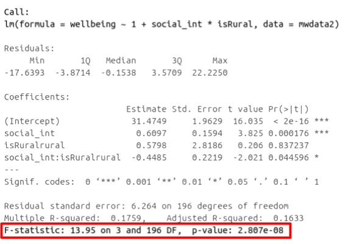

```{r setup, include=FALSE}
source('assets/setup.R')

set.seed(953)
```


:::green
Be sure to check the [**solutions to last week's exercises**](04_mlr_assumpt.html).<br>You can still ask any questions about previous weeks' materials if things aren't clear!
:::

# Model Fit 


:::frame
## Adjusted $R^2$  

We know from our work on simple linear regression that the R-squared can be obtained as:
$$
R^2 = \frac{SS_{Model}}{SS_{Total}} = 1 - \frac{SS_{Residual}}{SS_{Total}}
$$

However, when we add more and more predictors into a multiple regression model, $SS_{Residual}$ cannot increase, and may decrease by pure chance alone, even if the predictors are unrelated to the outcome variable. Because $SS_{Total}$ is constant, the calculation $1-\frac{SS_{Residual}}{SS_{Total}}$ will increase by chance alone. 

An alternative, the Adjusted-$R^2$, does not necessarily increase with the addition of more explanatory variables, by including a penalty according to the number of explanatory variables in the model. It is not by itself meaningful, but can be useful in determining what predictors to include in a model. 
$$
Adjusted{-}R^2=1-\frac{(1-R^2)(n-1)}{n-k-1} \\
\quad \\
\begin{align}
& \text{Where:} \\
& n = \text{sample size} \\
& k = \text{number of explanatory variables} \\
\end{align}
$$

---

**In R,** you can view the mutiple and adjusted $R^2$ at the bottom of the output of `summary(<modelname>)`:

```{r mlroutputrsq, echo=FALSE, fig.cap="Multiple regression output in R, summary.lm(). R-squared highlighted",fig.align = 'left'}
knitr::include_graphics("images/mlroutputrsq.png")
```

:::  

:::frame  
## F-ratio  

As in simple linear regression, the F-ratio is used to test the null hypothesis that all regression slopes are zero.  

It is called the F-ratio because it is the ratio of the how much of the variation is explained by the model (per paramater) versus how much of the variation is unexplained (per remaining degrees of freedom). 

$$
F_{df_{model},df_{residual}} = \frac{MS_{Model}}{MS_{Residual}} = \frac{SS_{Model}/df_{Model}}{SS_{Residual}/df_{Residual}} \\
\quad \\
\begin{align}
& \text{Where:} \\
& df_{model} = k \\
& df_{error} = n-k-1 \\
& n = \text{sample size} \\
& k  = \text{number of explanatory variables} \\
\end{align}
$$

---

**In R,** at the bottom of the output of `summary(<modelname>)`, you can view the F ratio, along with an hypothesis test against the alternative hypothesis that the at least one of the coefficients $\neq 0$ (under the null hypothesis that all coefficients = 0, the ratio of explained:unexplained variance should be approximately 1):

```{r mlroutputrf, echo=FALSE, fig.cap="Multiple regression output in R, summary.lm(). F statistic highlighted", fig.align = 'left'}

```
  
:::


`r qbegin(1)`
Run the code below. It reads in the wellbeing/rurality study data, and creates a new binary variable which specifies whether or not each participant lives in a rural location.  

```{r}
library(tidyverse)
mwdata2<-read_csv("https://uoepsy.github.io/data/wellbeing_rural.csv")
mwdata2 <- 
  mwdata2 %>% mutate(
  isRural = ifelse(location=="rural","rural","notrural")
)
```


Fit the following model, and assign it the name "wb_mdl1".

+ $\text{Wellbeing} = \beta_0 + \beta_1 \cdot \text{Social Interactions} + \beta_2 \cdot \text{IsRural} + \epsilon$  

Does the model provide a better fit to the data than a model with no explanatory variables? (i.e., test against the alternative hypothesis that at least one of the explanatory variables significantly predicts wellbeing scores). 

`r qend()`
`r solbegin(show=params$SHOW_SOLS, toggle=params$TOGGLE)`

```{r}
wb_mdl1 <- lm(wellbeing ~ social_int + isRural, data=mwdata2)
summary(wb_mdl1)
```

:::int
```{r echo=FALSE}
mdl1<-wb_mdl1
```
Weekly social interactions and location (rural vs not rural) explained `r paste0(round(summary(mdl1)$adj.r.squared*100,1),"%")` of the variance (adjusted $R^2$ =`r round(summary(mdl1)$adj.r.squared,3)`, $F$(`r paste(summary(mdl1)$fstatistic[2:3],collapse=",")`)=`r round(summary(mdl1)$fstatistic,1)[1]`, p`r map_chr(pf(summary(mdl1)$fstatistic[1],summary(mdl1)$fstatistic[2],summary(mdl1)$fstatistic[3], lower.tail = FALSE), ~ifelse(.<001,"<.001",paste0("=",round(.,2))))`)
:::
  
`r solend()`


# Model Comparison 


:::frame
## Incremental F-test  

:::yellow
If (*and only if*) two models are __nested__ (one model contains all the predictors of the other and is fitted to the same data), we can compare them using an __incremental F-test.__  

This is a formal test of whether the additional predictors provide a better fitting model.  
Formally this is the test of:  

+ $H_0:$ coefficients for the added/ommitted variables are all zero.
+ $H_1:$ at least one of the added/ommitted variables has a coefficient that is not zero. 
:::

The F-ratio for comparing the residual sums of squares between two models can be calculated as:

$$
F_{(df_R-df_F),df_F} = \frac{(SSR_R-SSR_F)/(df_R-df_F)}{SSR_F / df_F} \\
\quad \\
\begin{align}
& \text{Where:} \\
& SSR_R = \text{residual sums of squares for the restricted model} \\
& SSR_F = \text{residual sums of squares for the full model} \\
& df_R = \text{residual degrees of freedom from the restricted model} \\
& df_F = \text{residual degrees of freedom from the full model} \\
\end{align}
$$

---

**In R,** we can conduct an incremental F-test by constructing two models, and passing them to the `anova()` function: `anova(model1, model2)`. 

:::


`r qbegin(2)`
The F-ratio you see at the bottom of `summary(model)` is actually a comparison between two models: your model (with some explanatory variables in predicting $y$) and __the null model.__ In regression, the null model can be thought of as the model in which all explanatory variables have zero regression coefficients. It is also referred to as the __intercept-only model__, because if all predictor variable coefficients are zero, then the only we are only estimating $y$ via an intercept (which will be the mean - $\bar y$).  

Use the code below to fit the null model.  
Then, use the `anova()` function to perform a model comparison between your earlier model (**wb_mdl1**) and the null model.  
Check that the F statistic is the same as that which is given at the bottom of `summary(wb_mdl1)`.  

```{r}
null_model <- lm(wellbeing ~ 1, data = mwdata2)
```

`r qend()`
`r solbegin(show=params$SHOW_SOLS, toggle=params$TOGGLE)`

```{r}
# fit the null model
null_model <- lm(wellbeing ~ 1, data = mwdata2)

# model comparison null vs wb_mdl1
anova(null_model, wb_mdl1)

# extract f statistic from summary of wb_mdl1
summary(wb_mdl1)$fstatistic
# we can retrieve the p-value:
fstat = summary(wb_mdl1)$fstatistic[1]
df_1 = summary(wb_mdl1)$fstatistic[2]
df_2 = summary(wb_mdl1)$fstatistic[3]
pf(fstat, df_1, df_2, lower.tail = FALSE)
```
`r solend()`


`r qbegin(3)`
Does weekly outdoor time explain a significant amount of variance in wellbeing scores over and above weekly social interactions and location (rural vs not-rural)?  

Provide an answer to this question by fitting and comparing two models (one of them you may already have fitted in an earlier question). 

`r qend()`
`r solbegin(show=params$SHOW_SOLS, toggle=params$TOGGLE)`
We can compare the following models which predict wellbeing scores from weekly social interactions and location, with and without weekly outdoor time.  

+ $\text{Wellbeing} = \beta_0 + \beta_1 \cdot \text{Social Interactions} + \beta_2 \cdot \text{IsRural} + \epsilon$ 
+ $\text{Wellbeing} = \beta_0 + \beta_1 \cdot \text{Social Interactions} + \beta_2 \cdot \text{IsRural} + \beta_3 \cdot \text{Outdoor time} +  \epsilon$ 

We have already fitted the first model and assigned it the name `wb_mdl1`.  
We need to fit the second:
```{r}
wb_mdl2 <- lm(wellbeing ~ 1 + social_int + isRural + outdoor_time, data=mwdata2)
```

Let's look at the amount of variation in wellbeing scores explained by each model:
```{r}
summary(wb_mdl1)$adj.r.squared
summary(wb_mdl2)$adj.r.squared
```

The model *with* weekly outdoor time as a predictor explains 30\% of the variance, and the model *without* explains 25\%.  
Does including weekly outdoor time as a predictor provide a significantly better fit of the data (**wb_mdl2** compared to **wb_mdl1**)?  
```{r}
anova(wb_mdl1, wb_mdl2)
```
```{r include=FALSE}
mc <- anova(wb_mdl1, wb_mdl2)
names(mc)[6]<-"p"
```

:::int
Weekly outdoor time was found to explain a significant amount of variance in wellbeing scores over and above weekly social interactions and location (rural vs not-rural)  
$F$(`r paste(mc$Df[2],mc$Res.df[2],collapse=",")`)=`r round(mc$F,2)`, p`r map_chr(mc$p[2], ~ifelse(.<001,"<.001",paste0("=",round(.,2))))`.
:::

`r solend()`


:::frame 
## Incremental validity - A caution  

A common goal for researchers is to determine which variables matter (and which do not) in contributing to some outcome variable. A common approach to answer such questions is to consider whether some variable $X$'s contribution remains significant _after_ controlling for variables $Z$.  

The reasoning:  

+ If our measure of $X$ correlates significantly with outcome $Y$ even when controlling for our measure of $Z$, then $X$ contributes to $y$ *over and above* the contribution of $Z$. 
    
  
In multiple regression, we might fit the model $Y = \beta_0 + \beta_1 \cdot X + \beta_2 \cdot Z + \epsilon$ and conclude that $X$ is a useful predictor of $Y$ *over and above* $Z$ based on the estimate $\hat \beta_1$, or via model comparison between that model and the model without $Z$ as a predictor ($Y = \beta_0 + \beta_1 \cdot X + \epsilon$).  
  
__A Toy Example__
  
Suppose we have monthly data over a seven year period which captures the number of shark attacks on swimmers each month, and the number of ice-creams sold by beach vendors each month.  
Consider the relationship between the two:  
```{r echo=FALSE}
read_csv("https://uoepsy.github.io/data/sharks.csv") %>%
ggplot(.,aes(x=ice_cream_sales,y=shark_attacks))+geom_point()+stat_smooth(method="lm")
```

We can fit the linear model and see a significant relationship between ice cream sales and shark attacks:  
```{r}
sharkdata <- read_csv("https://uoepsy.github.io/data/sharks.csv")
shark_mdl <- lm(shark_attacks ~ ice_cream_sales, data = sharkdata)
summary(shark_mdl)
```

`r qbegin()`
Does the relationship between ice cream sales and shark attacks make sense? What might be missing from our model? 
`r qend()`
`r solbegin(show=TRUE, toggle=FALSE)`
You might quite rightly suggest that this relationship is actually being driven by temperature - when it is hotter, there are more ice cream sales _and_ there are more people swimming (hence more shark attacks). 
`r solend()`


`r qbegin()`
Is $X$ (the number of ice-cream sales) a useful predictor of $Y$ (numbers of shark attacks) over and above $Z$ (temperature)?  
<br>
We might answer this with a multiple regression model including both temperature and ice cream sales as predictors of shark attacks: 
```{r}
shark_mdl2 <- lm(shark_attacks ~ ice_cream_sales + temperature, data = sharkdata)
summary(shark_mdl2)
```
<br>
What do you conclude?

`r qend()`
`r solbegin(show=TRUE, toggle=FALSE)`
It appears that numbers of ice cream sales is _not_ a significant predictor of sharks attack numbers over and above the temperature.  
`r solend()`

__However...__
In psychology, we can rarely observe and directly measure the constructs which we are interested in (for example, personality traits, intelligence, emotional states etc.). We rely instead on measurements of, e.g. behavioural tendencies, as a proxy for personality traits.  

Let's suppose that instead of including temperature in degrees celsius, we asked a set of people to self-report on a scale of 1 to 7 how hot it was that day. This measure should hopefully correlate well with the _actual_ temperature, however, there will likely be some variation: 
```{r echo=FALSE}
ggplot(data = sharkdata, aes(x = temperature, y = sr_heat)) + 
  geom_point() + 
  labs(title = paste0("r = ",round(cor(sharkdata$temperature, sharkdata$sr_heat),2)), 
       x = "actual temperature",y="self report measure of heat")
```

`r qbegin()`
Is $X$ (the number of ice-cream sales) a useful predictor of $Y$ (numbers of shark attacks) over and above $Z$ (temperature - measured on our self-reported heat scale)?  
<br>
```{r}
shark_mdl2a <- lm(shark_attacks ~ ice_cream_sales + sr_heat, data = sharkdata)
summary(shark_mdl2a)
```
<br>
What do you conclude?
`r qend()`

Moral of the story: be considerate of what exactly it is that you are measuring. 
<br>
This example was adapted from [Westfall and Yarkoni, 2020](https://onlinelibrary.wiley.com/doi/full/10.1111/pere.12309) which provides a much more extensive discussion of incremental validity and type 1 error rates. 


:::


:::frame
## AIC & BIC  

We can also compare models using information criterion statistics, such as AIC and BIC. These combine information about the sample size, the number of model parameters and the residual sums of squares ($SS_{residual}$). Models do not need to be nested to be compared via AIC and BIC, but they need to have been fit to the same dataset.  
For both of these fit indices, lower values are better, and both include a penalty for the number of predictors in the model, although BIC's penalty is harsher:

$$
AIC = n\,\text{ln}\left( \frac{SS_{residual}}{n} \right) + 2k \\
\quad \\
BIC = n\,\text{ln}\left( \frac{SS_{residual}}{n} \right) + k\,\text{ln}(n) \\
\quad \\
\begin{align}
& \text{Where:} \\
& SS_{residual} = \text{sum of squares residuals} \\
& n = \text{sample size} \\
& k = \text{number of explanatory variables} \\
& \text{ln} = \text{natural log function} 
\end{align}
$$

---

**In R,** we can calculate AIC and BIC by using the `AIC()` and `BIC()` functions. 

:::


`r qbegin(4)`
The code below fits 5 different models:

```{r eval=FALSE}
model1 <- lm(wellbeing ~ social_int + outdoor_time, data = mwdata2)
model2 <- lm(wellbeing ~ social_int + outdoor_time + age, data = mwdata2)
model3 <- lm(wellbeing ~ social_int + outdoor_time + routine, data = mwdata2)
model4 <- lm(wellbeing ~ social_int + outdoor_time + routine + age, data = mwdata2)
model5 <- lm(wellbeing ~ social_int + outdoor_time + routine + steps_k, data = mwdata2)
```

For each of the below pairs of models, what methods are/are not available for us to use for comparison and why?  

+ `model1` vs `model2`
+ `model2` vs `model3`
+ `model1` vs `model4`
+ `model3` vs `model5`

`r qend()`
`r solbegin(show=params$SHOW_SOLS, toggle=params$TOGGLE)`

+ `model1` vs `model2`  
  These models are nested - `model2` contains all the variables of `model1` and they are fitted on the same dataset.  
  We can therefore use an F-test, AIC or BIC.  
    
+ `model2` vs `model3`  
  These models are __not__ nested, but they are fitted on the same dataset.  
  We can therefore use AIC or BIC, but we cannot use an F-test.  
    
+ `model1` vs `model4`
  These models are nested - `model4` contains all the variables of `model1` and they are fitted on the same dataset.  
  We can therefore use an F-test, AIC or BIC.  
    
+ `model3` vs `model5`  
  These models are __not__ nested, and they are __not__ fitted on the same dataset. the "steps_k" variable contains missing values, and so these whole rows are excluded from `model5` (but they are included in `model3`). We cannot compare these models.   

`r solend()`


`r qbegin(5)`
Recall the data on Big 5 Personality traits, perceptions of social ranks, and depression and anxiety scale scores: 

```{r}
scs_study <- read_csv("https://uoepsy.github.io/data/scs_study.csv")
summary(scs_study)
```


> **Research question**   
> 
> + Beyond neuroticism and its interaction with social comparison, do other personality traits predict symptoms of depression, anxiety and stress?
>   

Construct and compare multiple regression models to answer this question. Remember to check that your models meet assumptions (for this exercises, a quick eyeball of the diagnostic plots will suffice. Were this an actual research project, you would want to provide a more thorough check, for instance conducting formal tests of the assumptions).  
<br>
Although the solutions are available immediately for this question, we strongly advocate that you attempt it yourself before looking at them. 
`r qend()`
`r solbegin(show=TRUE, toggle=params$TOGGLE)`

First let us mean-center our social comparison scale scores, as we did in the previous labs.
```{r}
scs_study <- 
  scs_study %>%
  mutate(
    scs_mc = scs - mean(scs)
  )
```


```{r echo=FALSE}
par(mfrow=c(2,2))
```

The question is asking whether including a group of predictors (the O, C, E, A personality traits) improves model fit beyond a model with just neuoriticism, social comparison score and their interaction.  

Notice how our initial model has one very influential point, which we will remove:
```{r eval=FALSE}
dass_mod <- lm(dass ~ scs_mc * zn, data = scs_study)
plot(dass_mod)
```
```{r echo=FALSE}
dass_mod <- lm(dass ~ scs_mc * zn, data = scs_study)
par(mfrow=c(2,2))
plot(dass_mod)
par(mfrow=c(1,1))
```

```{r eval=FALSE}
dass_mod <- lm(dass ~ scs_mc * zn, data = scs_study[-35, ])
plot(dass_mod)
```
```{r echo=FALSE}
dass_mod <- lm(dass ~ scs_mc * zn, data = scs_study[-35, ])
par(mfrow=c(2,2))
plot(dass_mod)
par(mfrow=c(1,1))
```

And our full model, with the other personality variables included:
```{r eval=FALSE}
dass_mod2 <- lm(dass ~ scs_mc * zn + zo + zc + ze + za, data = scs_study[-35, ])
plot(dass_mod2)
```
```{r echo=FALSE}
dass_mod2 <- lm(dass ~ scs_mc * zn + zo + zc + ze + za, data = scs_study[-35, ])
par(mfrow=c(2,2))
plot(dass_mod2)
par(mfrow=c(1,1))
```

We can explore the individual coefficients of our full model, and we notice that none of the other personality variables (`zo`, `zc`, `ze`, `za`) significantly predict DASS-21 scores:
```{r}
summary(dass_mod2)
```

However, when we compare the two models, we find that including these predictors does significantly improve model fit. 
```{r}
anova(dass_mod, dass_mod2)
```

This may be a bit confusing - are we saying that none of openness, conscientiousness, agreeableness, or extraversion significantly predict DASS-21 scores, but collectively they do?  
  
This sort of discrepancy can often be the result of multicollinearity. Note that there may be some correlation between the `za` and `ze` variables: 
```{r}
library(car)
vif(dass_mod2)
```

What may actually be happening here is that one variable is _masking_ the effect of the other. Note that when we take one of them out, the other becomes significant: 
```{r}
lm(dass ~ scs_mc * zn + zo + zc + ze, data = scs_study[-35, ]) %>% summary
```

`r solend()`


# Extra Exercises: Model Selection  

__"Which predictors should I include in my model?"__  

As a rule of thumb, you should include as predictors your variables of interest (i.e., those required to answer your questions), and those which theory suggests you should take into account (for instance, if theory tells you that temperature is likely to influence the number of shark attacks on a given day, it would be remiss of you to not include it in your model).  

However, in some specific situations, you may simply want to let the data tell you whatever there is to tell, without being guided by theory. This is where analysis becomes **exploratory** in nature (and therefore should *not* be used as confirmatory evidence in support of theory).  

In both the design and the analysis of a study, you will have to make many many choices. Each one takes you a different way, and leads to a different set of choices. This idea has become widely known as the [garden of forking paths](https://www.americanscientist.org/article/the-statistical-crisis-in-science), and has important consequences for your statistical inferences.  

Out of all the possible paths you could have taken, some will end with what you consider to be a significant finding, and some you will simply see as dead ends. If you reach a dead-end, do you go back and try a different path? Why might this be a risky approach to statistical analyses? 

For a given set of data, there will likely be some significant relationships between variables which are there simply by chance (recall that $p<.05$ corresponds to a 1 in 20 chance - if we study 20 different relationships, we would expect one of them two be significant by chance). The more paths we try out, the more likely we are to find a significant relationship, even though it may actually be completely spurious!  

Model selection is a means of answering the question "which predictors should I include in my model?", but it is a big maze of forking paths, which will result in keeping only those predictors which meet some criteria (e.g., significance). 

:::frame
## Stepwise

__Forward Selection__  

+ Start with variable which has highest association with DV.
+ Add the variable which most increases $R^2$ out of all which remain.
+ Continue until no variables improve $R^2$.  

__Backward Elimination__  

+ Start with all variables in the model.
+ Remove the predictor with the highest p-value.
+ Run the model again and repeat.  
+ Stop when all p-values for predictors are less than the _a priori_ set critical level.  

<br>
Note that we can have different criteria for selecting models in this stepwise approach, for instance, choosing the model with the biggest decrease in AIC. 

:::


`r qbegin(6)`
Using the backward elimination approach, construct a final model to predict wellbeing scores using the `mwdata2` dataset from above.   
`r qend()`
`r solbegin(show=params$SHOW_SOLS, toggle=params$TOGGLE)`
We will stop when all p-values are $<.05$

Note that we have two variables in there which are direct transformations of one another - "location" and "isRural". We can't have both.
```{r}
summary(mwdata2)

full_model <- lm(wellbeing ~ age + outdoor_time + social_int + routine + location + steps_k, data = mwdata2)
summary(full_model)
```

We will remove the "steps_k" variable, as it is the predictor with the highest p-value (don't be tempted to think that "location" has the highest p-value. The estimated difference between urban and suburban does indeed have a high p-value, but the difference between rural and urban has a very low p-value).

```{r}
model1 <- lm(wellbeing ~ age + outdoor_time + social_int + routine + location, data = mwdata2)
summary(model1)
```
And now the "age" variable:

```{r}
model2 <- lm(wellbeing ~ outdoor_time + social_int + routine + location, data = mwdata2)
summary(model2)
```

In this model, all our predictors have p-values lower than our critical level of $.05$. 

`r solend()`


`r qbegin(7)`
There are functions in R which automate the stepwise procedure for us.  
`step(<modelname>)` will by default use backward elimination to choose the model with the lowest AIC.  

1. Using data on the Big 5 Personality traits, perceptions of social ranks, and depression and anxiety, fit the full model to predict DASS-21 scores.
2. Use `step()` to determine which predictors to keep in your model. 
3. What predictors do you have in your final model?

`r qend()`
`r solbegin(show=params$SHOW_SOLS, toggle=params$TOGGLE)`
```{r}
full_dass_model <- lm(dass ~ zn*scs_mc + zo + zc + ze + za + zn, data = scs_study)
step(full_dass_model)
```
`r solend()`

--- 

Extra reading: [Joshua Loftus' Blog: Model selection bias invalidates significance tests](http://joshualoftus.com/post/model-selection-bias-invalidates-significance-tests/)
    

<div class="tocify-extend-page" data-unique="tocify-extend-page" style="height: 0;"></div>


