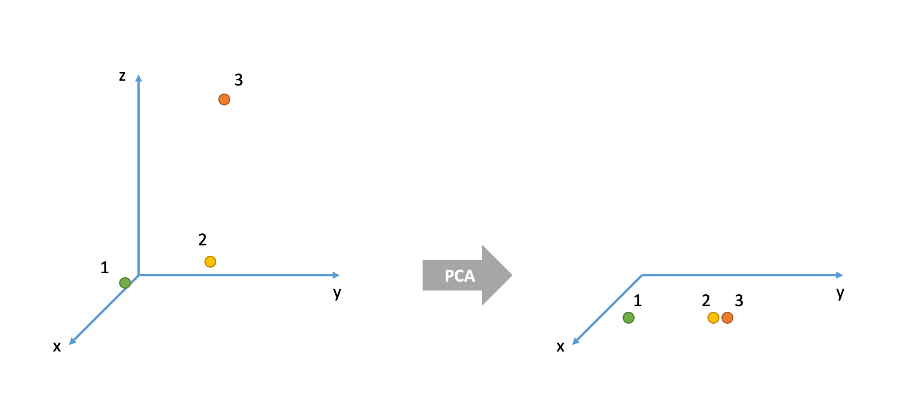

```{r setup, include=FALSE}
source('assets/setup.R')
```

```{r echo=FALSE}
set.seed(3)
```


# Data wrangling for data reduction  

The [rms2_recodedata.csv](https://uoepsy.github.io/data/rms2_recodedata.csv) dataset contains responses from 180 people on 10 personality items measuring _Need for Cognition_. A list of these items can be seen below. Each one was measured on a score from 1 to 6. 

```{r echo=FALSE}
library(tidyverse)
library(gt)
surveydf <- read_csv("https://uoepsy.github.io/data/rms2_recodedata.csv")

tibble(
    variable = c("d185","d186","d187","d188","d189","d190","d191","d192","d193","d194"),
    question = c("I really enjoy a task that involves coming up with new solutions to problems","I only think as hard as I have to","I like tasks that require little thought once I've learned them","I tend to set goals that can be accomplished only by expending considerable mental effort","I find little satisfaction in deliberating hard and for long hours","I think best when those around me are very intelligent","I don't like to have the responsibility of handling a situation that requires a lot of thought","I prefer my life to be filled with puzzles that I must solve","Thinking is not my idea of fun","I prefer complex to simple problems")
) %>%
  gt() %>% 
  tab_header(title="Data Dictionary")
```

## $\min \leq y \leq \max$

`r qbegin(1)`
Read the data into R. Provide numerical summaries of the variables in the data frame. If you wish, you could try the `describe()` function from the **psych** package. 

Given the description of the data above, is anything looking odd?
`r qend()`
`r solbegin(show=params$SHOW_SOLS, toggle=params$TOGGLE)`

```{r}
library(tidyverse)
surveydf <- read_csv("https://uoepsy.github.io/data/rms2_recodedata.csv")
```

_Option 1:_ the `summary()` function
```{r}
summary(surveydf)
```

_Option 2:_ the `describe()` function from the `psych` package:
```{r}
library(psych)
describe(surveydf)
```

Some items have a minimum score smaller than 1, and other items have a maximum score greater than 6. Hence, these items have scores which do not belong to the 1-6 scale employed.

`r solend()`

`r qbegin(2)`
For each item, we want to take all the values <1 and >6 and set them to NA. The `ifelse()` function will help you doing so.

Think about the syntax "if *this* is true, then make it *this*, else make it *this*". For example, `ifelse(data$variable == 5, "five", "not five")`   

You can do this for each variable individually, using e.g, 
```{r eval=FALSE,echo=TRUE}
surveydf %>%
  mutate(
    d185 = ifelse(d185 == 5, "five", "not five"),
    d186 = ifelse(d186 == 5, "five", "not five"),
    ...
    ...
  )
```

or we can do it using `mutate()` in combination with the `across()` function. The across function tells R to mutate the data across many variables (in this case all of them: `everything()`) and it also requires creating a function which represents the transformation that we want to apply to each variable. The function requires a generic variable name (in this case `x`), checks whether each entry in `x` is equal to 5 and, if it is, it replaces it by "five" while, if it isn't, it replaces it by "not five". The x will be replaced with each variable in the data set automatically so that with just one line you do the transformations on all d185, d186, and so on.

```{r echo=TRUE, eval=FALSE}
surveydf %>%
  mutate(across(everything(), function(x) ifelse(x == 5, "five", "not five")))
```

For each item, take all the values <1 and >6 and set them to NA.  

`r qend()`
`r solbegin(show=params$SHOW_SOLS, toggle=params$TOGGLE)`

Either:
```{r}
surveydf %>%
  mutate(
    d185 = ifelse(d185 < 1 | d185 > 6, NA, d185),
    d186 = ifelse(d186 < 1 | d186 > 6, NA, d186),
    d187 = ifelse(d187 < 1 | d187 > 6, NA, d187),
    d188 = ifelse(d188 < 1 | d188 > 6, NA, d188),
    d189 = ifelse(d189 < 1 | d189 > 6, NA, d189),
    d190 = ifelse(d190 < 1 | d190 > 6, NA, d190),
    d191 = ifelse(d191 < 1 | d191 > 6, NA, d191),
    d192 = ifelse(d192 < 1 | d192 > 6, NA, d192),
    d193 = ifelse(d193 < 1 | d193 > 6, NA, d193),
    d194 = ifelse(d194 < 1 | d194 > 6, NA, d194)
)
```


or: 
```{r}
surveydf <- 
  surveydf %>%
  mutate(across(everything(), function(x) ifelse(x < 1 | x > 6, NA, x)))
```
`r solend()`


## Reverse coding  

`r qbegin(3)`
Sometimes we want to reverse-code items, so that the constructs which we believe them to be measuring all follow the same direction. For instance, consider the two questions below. Does 5 represent a similar thing on both questions? No, in fact we can theorise about a common underlying construct which would result in people generally answering 1 to "I love parties" and 5 to "I hate social gatherings" (or vice versa). So we can simply reverse the scores on one of the questions to make them follow the same pattern.
```{r echo=FALSE}

```

Take a look at the descriptions of the items above. Are there any you believe should be reverse coded?

**Hint:** Looking at `cor(na.omit(surveydf))` might help to decide!  

Reverse code any items you believe should be reverse-coded.  

**Hint:** To reverse an item with scores ranging from min 1 to max 5, we need to make all the scores of 1 become 5, scores of 2 become 4, and so on…   
What number satisfies all of these equations:  

+ ? - 5 = 1
+ ? - 4 = 2
+ ? - 3 = 3
+ ? - 2 = 4
+ ? - 1 = 5

`r qend()`
`r solbegin(show=params$SHOW_SOLS, toggle=params$TOGGLE)`
```{r}
library(pheatmap)
pheatmap(cor(na.omit(surveydf)))
```

From this we can see that the odd items are negative, and the even ones are positive.  
From looking at the item labels, it is clear that for those items, if someone strongly agreed (scored 6), then they would be low in _Need for Cognition_. I want a high score to be high _Need for Cognition_. As a result, I want to reverse the even items d186, d188, d190, d192, d194.   


The quickest way is:
```{r}
surveydf %>%
  mutate(across(c(d186, d188, d190, d192, d194), function(x) 6 - x))
```

In the code above, `function(x) 6 - x` is simply a function defining the mapping that will be applied.
This mapping will be applied to all variables specified within the first argument of `across`.
`r solend()`


## Rowwise summaries  

`r qbegin(4)`
Often, for various psychometric scales, we want to get an overall score for a participant across all the items in the scale.  
Sometimes this will be the sum of all their scores, and sometimes this will be the mean.  
These are then often used in clinical settings with various cut-offs for different ages taken to indicate things such as cognitive impairment.  

R has some handy functions for calculating these scores. Remember that each participant is a row in the data set. We want, for each row, to calculate the sum. 
The relevant function is `rowSums()`! 

There is also a `rowMeans()` function (I bet you can't guess what that function does!)
`r qend()`
`r solbegin(show=params$SHOW_SOLS, toggle=params$TOGGLE)`
The sum of the scores for each case is:
```{r}
surveydf %>%
  mutate(total_score = rowSums(.)) %>% 
  relocate(total_score)   # puts the new column first
```

If we were to compute the mean score for each participant, instead, we would do:
```{r}
surveydf %>%
  mutate(mean_score = rowMeans(.)) %>% 
  relocate(mean_score)
```

`r solend()`


# Principal component analysis (PCA)


## Goal

The goal of principal component analysis (PCA) is to find a _smaller_ number of uncorrelated variables which are linear combinations of the original (_many_) variables and explain most of the variation in the data.


## Job performance data

The file [job_performance.csv](https://uoepsy.github.io/data/job_performance.csv) contains data on fifty police officers who were rated in six different categories as part of an HR procedure. The rated skills were:

- communication skills: `commun`
- problem solving: `probl_solv`
- logical ability: `logical`
- learning ability: `learn`
- physical ability: `physical`
- appearance: `appearance`


`r qbegin(5)`
Load the job performance data into R and all it `job`. Check whether or not the data were read correctly into R.
`r qend()`
`r solbegin(show=params$SHOW_SOLS, toggle=params$TOGGLE)`
Let's load the data:

```{r, message=FALSE}
library(tidyverse)

job <- read_csv('https://uoepsy.github.io/data/job_performance.csv')
dim(job)
```
There are 50 observations on 6 variables.

The top 6 rows in the data are:
```{r}
head(job)
```
`r solend()`


`r qbegin(6)`
Provide summary statistics for each variable in the data set.
`r qend()`
`r solbegin(show=params$SHOW_SOLS, toggle=params$TOGGLE)`
We now inspect some descriptive statistics for each variable in the dataset:
```{r}
# Quick summary
summary(job)
```


__OPTIONAL__

If you wish to create a nice looking table for a report, you could try the following code. 
However, I should warn you: this code is quite difficult to understand so, if you are interested, attend a drop-in!

```{r}
library(gt)

# Mean and SD of each variable
job %>% 
  summarise(across(everything(), list(M = mean, SD = sd))) %>%
  pivot_longer(everything()) %>%
  mutate(name = str_replace(name, '_M', '.M'),
         name = str_replace(name, '_SD', '.SD')) %>%
  separate(name, into = c('variable', 'summary'), sep = '\\.') %>%
  pivot_wider(names_from = summary, values_from = value) %>% 
  gt()
```
`r solend()`


## Is PCA needed?

If the original variables are highly correlated, it is possible to reduce the dimensionality of the problem under investigation without losing too much information.

On the other side, when the correlation between the variables under study is weak, a larger number of components is needed in order to explain sufficient variability.

`r qbegin(7)`
Investigate whether or not the recorded variables are highly correlated and explain whether or not you PCA might be useful in this case.
`r qend()`
`r solbegin(show=params$SHOW_SOLS, toggle=params$TOGGLE)`
Let's start by looking at the correlation matrix of the data:
```{r, fig.align='center', fig.height=4, fig.width=5, fig.cap="Correlation between the variables in the ``Job'' dataset"}
library(pheatmap)

R <- cor(job)

pheatmap(R, breaks = seq(-1, 1, length.out = 100))
```

The correlation between the variables seems to be quite large.^[If negative correlations were present, we would think in absolute value.]

There appears to be a group of highly correlated variables comprising physical ability, appearance, communication skills, and learning ability which are correlated among themselves but uncorrelated with another group of variables.
The second group comprises problem solving and logical ability.

This suggests that PCA might be useful in this problem to reduce the dimensionality without a significant loss of information.
`r solend()`


## Should PCA be performed on the covariance or correlation matrix?

This depends on the variances of the variables in the dataset.
If the variables have large differences in their variances, then the variables with the largest variances will tend to dominate the first few principal components.

`r qbegin(8)`
Look at the variance of the variables in the data set. Do you think that PCA should be carried on the covariance matrix or the correlation matrix?
`r qend()`
`r solbegin(show=params$SHOW_SOLS, toggle=params$TOGGLE)`
Let's have a look at the standard deviation of each variable:
```{r}
job %>% 
  summarise(across(everything(), sd))
```

As the standard deviations appear to be fairly similar (and so will the variances) we can perform PCA using the covariance matrix.
`r solend()`


## Perform PCA

`r qbegin(9)`
Using the `principal()` function from the `psych` package, perform a PCA of the job performance data. Call the output `job_pca`.
```
job_pca <- principal(job, nfactors = ncol(job), covar = ..., rotate = 'none')
job_pca$loadings
```
Depending on your answer to the previous question, either set `covar = TRUE` or `covar = FALSE` within the `principal()` function.

**Warning:** the output of the function will be in terms of standardized variables nevertheless. So you will see output with standard deviation of 1.
`r qend()`
`r solbegin(show=params$SHOW_SOLS, toggle=params$TOGGLE)`
```{r}
library(psych)

job_pca <- principal(job, nfactors = ncol(job), covar = TRUE, rotate = 'none')
job_pca$loadings
```

The output is made up of two parts.

First, it shows the *loading matrix*. In each column of the loading matrix we find how much each of the measured variables contributes to the computed new axis/direction (that is, the principal component).
Notice that there are as many principal components as variables. Next, there are extra columns called

The second part of the output displays the contribution of each component to the total variance.

Before interpreting it however, let's focus on the last row of that output called "Cumulative Var". This displays the cumulative sum of the variances of each principal component.
Taken all together, the six principal components taken explain all of the total variance in the original data.
In other words, the total variance of the principal components (the sum of their variances) is equal to the total variance in the original data (the sum of the variances of the variables).

However, our goal is to reduce the dimensionality of our data, so it comes natural to wonder which of the six principal components explain most of the variability, and which components instead do not contribute substantially to the total variance.

To that end, the second row "Proportion Var" displays the proportion of the total variance explained by each component, i.e. the variance of the principal component divided by the total variance.

The last row, as we saw, is the cumulative proportion of explained variance: `0.673`, `0.673 + 0.210`, `0.673 + 0.210 + 0.105`, and so on.

We also notice that the first PC alone explains 67.3% of the total variability, while the first two components together explain almost 90% of the total variability.
From the third component onwards, we do not see such a sharp increase in the proportion of explained variance, and the cumulative proportion slowly reaches the total ratio of 1 (or 100%).
`r solend()`


## How many principal components should we keep?

There is no single best method to select the optimal number of components to keep, while discarding the remaining ones (which are then considered as noise components).

The following three heuristic rules are commonly used in the literature:

- The cumulative proportion of explained variance criterion
- Kaiser's rule
- The scree plot
- Velicer's Minimum Average Partial method
- Parallel analysis

In the next sections we will analyse each of them in turn.


### The cumulative proportion of explained variance criterion

The rule suggests to **keep as many principal components as needed in order to explain approximately 80-90% of the total variance.**


`r qbegin(10)`
Looking again at the PCA output, how many principal components would you keep if you were following the cumulative proportion of explained variance criterion?
`r qend()`
`r solbegin(show=params$SHOW_SOLS, toggle=params$TOGGLE)`
Let's look again at the PCA summary:

```{r}
job_pca$loadings
```

The following part of the output tells us that the first two components explain 88.3% of the total variance.
```
Cumulative Var 0.673 0.883 0.988 0.994 0.997 1.000
```

According to this criterion, we should keep 2 principal components.
`r solend()`


### Kaiser's rule

According to Kaiser's rule, we should **keep the principal components having variance larger than 1**. Standardized variables have a variance equal 1. Because we have 6 variables in the data set, and the total variance is 6, the value 1 represents the average variance in the data:
$$
\frac{1 + 1 + 1 + 1 + 1 + 1}{6} = 1
$$

__Hint:__

The variances of each PC are shown in the row of the output named `SS loadings` and also in
`job_pca$values`. The average variance is:

```{r}
mean(job_pca$values)
```


`r qbegin(11)`
Looking again at the PCA output, how many principal components would you keep if you were following Kaiser's criterion?
`r qend()`
`r solbegin(show=params$SHOW_SOLS, toggle=params$TOGGLE)`
```{r}
job_pca$loadings
```

The variances are shown in the row
```
SS loadings    4.035 1.261 0.631 0.035 0.022 0.016
```

From the result we see that only the first two principal components have variance greater than 1, so this rule suggests to keep 2 PCs only.
`r solend()`


### The scree plot

The scree plot is a graphical criterion which involves plotting the variance for each principal component.
This can be easily done by calling `plot` on the variances, which are stored in `job_pca$values`

```{r}
plot(x = 1:length(job_pca$values), y = job_pca$values, 
     type = 'b', xlab = '', ylab = 'Variance', 
     main = 'Police officers: scree plot', frame.plot = FALSE)
```

where the argument `type = 'b'` tells R that the plot should have _both_ points and lines.

A typical scree plot features higher variances for the initial components and quickly drops to small variances where the curve is almost flat.
The flat part of the curve represents the noise components, which are not able to capture the main sources of variability in the system. 

According to the scree plot criterion, we should **keep as many principal components as where the "elbow" in the plot occurs.** By elbow we mean the variance before the curve looks almost flat.


Alternatively, some people prefer to use the function `scree()` from the `psych` package:

```{r}
scree(job, factors = FALSE)
```

This also draws a horizontal line at y = 1. So, if you are making a decision about how many PCs to keep by looking at where the plot falls below the y = 1 line, you are basically following Kaiser's rule. In fact, Kaiser's criterion tells you to keep as many PCs as are those with a variance (= eigenvalue) greater than 1.


`r qbegin(12)`
According to the scree plot, how many principal components would you retain?
`r qend()`
`r solbegin(show=params$SHOW_SOLS, toggle=params$TOGGLE)`
This criterion then suggests to keep three principal components.
`r solend()`


### Velicer’s Minimum Average Partial method


`r qbegin(13)`
How many components should we keep according to the MAP method?
`r qend()`
`r solbegin(show=params$SHOW_SOLS, toggle=params$TOGGLE)`
```{r}
job_map <- VSS(job, plot=FALSE, method="pc", n = ncol(job))$map
paste("MAP is lowest for", which.min(job_map), "components")
```

According to the MAP criterion we should keep 2 principal components.
`r solend()`


### Parallel analysis


`r qbegin(14)`
How many components should we keep according to parallel analysis?
`r qend()`
`r solbegin(show=params$SHOW_SOLS, toggle=params$TOGGLE)`
```{r}
fa.parallel(job, fa="pc", quant=.95)
```

Parallel analysis suggests to keep 1 principal component only as there is only one PC with an eigenvalue higher than the simulated random ones in red.

`r solend()`


## Interpretation

Because three out of the five selection criteria introduced above suggest to keep 2 principal components, in the following we will work with the first two PCs only.

Let's have a look at the selected principal components:
```{r}
job_pca$loadings[, 1:2]
```

and at their corresponding proportion of total variance explained:
```{r}
job_pca$values / sum(job_pca$values)
```

We see that the first PC accounts for 67.3% of the total variability. All loadings seem to have the same magnitude apart from `probl_solv` and `logical` which are closer to zero.
The first component looks like a sort of average of the officers performance scores excluding problem solving and logical ability.

The second principal component, which explains only 21% of the total variance, has two loadings clearly distant from zero: the ones associated to problem solving and logical ability.
It distinguishes police officers with strong logical and problem solving skills and a low score on the test (note the negative magnitude) from the other officers.

We have just seen how to interpret the first components by looking at the magnitude and sign of the coefficients for each measured variable.

For interpretation purposes, it might help hiding very small scores in the loadings. This can be done by specifying the cutoff value in the `print()` function. However, this only works when you pass the loadings for **all** the PCs:
```{r}
print(job_pca$loadings, cutoff = 0.3)
```


<br>

In the literature, some authors also suggest to look at the correlation between each principal component and the measured variables:

```{r}
# First PC
cor(job_pca$scores[,1], job)
```

The first PC is strongly correlated with all the measured variables except `probl_solv` and `logical`.
As we mentioned above, all variables seem to contributed to the first PC.

```{r}
# Second PC
cor(job_pca$scores[,2], job)
```

The second PC is strongly correlated with `probl_solv` and `logical`, and slightly negatively correlated with the remaining variables. This separates police offices with clear logical and problem solving skills and a small score on the test (negative sign) from the others.


## Plot the retained principal components

We can now visualise the statistical units (police officers) in the reduced space given by the retained principal components.

```{r, fig.width=5, fig.align='center'}
plot(x = job_pca$scores[, 1], y = job_pca$scores[, 2], 
     pch = 16, col = 'dodgerblue', xlab = 'PC1', ylab = 'PC2')
```


`r optbegin('Optional', FALSE, show = TRUE, toggle = params$TOGGLE)`
**How well are the units represented in the reduced space?**

We now focus our attention on the following question: Are all the statistical units (police officers) well represented in the 2D plot?

The 2D representation of the original data, which comprise 6 measured variables, is an approximation and henceforth it may happen that not all units are well represented in this new space.

Typically, it is good to assess the approximation for each statistical unit by inspecting the scores on the discarded principal components.
If a unit has a high score on those components, then this is a sign that the unit might be highly misplaced in the new space and misrepresented.


Consider the 3D example below. There are three cases (= units or individuals). In the original space they are all very different from each other. For example, cases 1 and 2 are very different in their x and y values, but very similar in their z value. Cases 2 and 3 are very similar in their x and y values but very different in their z value. Cases 1 and 3 have very different values for all three variables x, y, and z.

However, when represented in the 2D space given by the two principal components, units 2 and 3 seems like they are very similar when, in fact, they were very different in the original space which also accounted for the z variable.

```{r, echo=FALSE, out.width="\\textwidth", include=TRUE, fig.align="center"}

```

We typically measure how badly a unit is represented in the new coordinate system by considering the **sum of squared scores on the discarded principal components:**

```{r}
scores_discarded <- job_pca$scores[, -(1:2)]
sum_sq <- rowSums(scores_discarded^2)
sum_sq
```

Units with a high score should be considered for further inspection as it may happen that they are represented as close to another unit when, in fact, they might be very different.

```{r}
boxplot(sum_sq)
```

There seem to be only five outliers, and they are not too high compared to the rest of the scores. For this reason, we will consider the 2D representation of the data to be satisfactory.
`r optend()`


<!-- Formatting -->

<div class="tocify-extend-page" data-unique="tocify-extend-page" style="height: 0;"></div>
