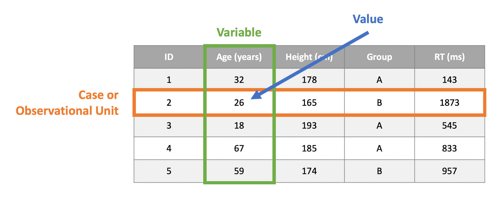

```{r setup, include=FALSE}
source('assets/setup.R')

# knitr::opts_chunk$set(cache = TRUE)
set.seed(1)
```


:::lo
**LEARNING OBJECTIVES**

1. Understand what is tidyverse and why it is used 
1. Understand the link between data frames and tibbles
1. Be able to read data into tibbles and manipulate them
1. Be able to create grammar-of-graphics plots
:::


# What is tidyverse?

If you took RMS1, you are already familiar with data and data frames. 
If not, a data frame is a data structure used to store data organised in rows and columns.

Each row corresponds to an *observational unit* or *case.* Each column represents a *variable*, obtained by recording a particular attribute of the cases.

```{r echo=FALSE, out.width = '90%', fig.cap='Illustration of a data frame structure.'}

```

The variables need not be all of the same type. Some could be numeric, other categorical.^[
Numeric variables are data for which standard arithmetic operations, like addition and taking the mean, make sense.
Categorical variables are data telling us which category/group each case belongs to. In R, these are encoded as a `factor()`.
] However, the main features of a data set are two:

1. The columns need to all have the same length, i.e. the same number of cases;
2. Each column should have values of the same type.

Point (1) makes sure that we know who each value refers to. Each row in the data frame should refer to the same case or individual.
Point (2), instead, means that you can not have Age = 53, "Apricot", 20, "Kiwi". This would make it confusing, and perhaps "Apricot" and "Kiwi" refer to the favourite fruit of each individual.

In RMS1 you worked with the `data.frame()` function, used `$` to select columns, and `[rows, columns]` for indexing.

As data becomes messier and bigger, some R users created a new data frame, called **tibble**, that comes with handy features such as pretty printing, automatic display of dimensions (\# of rows and \# of columns), and also automatic display of the type of each variable under its name.

The work has then been extended to create many useful functions that let you easily subset, transform, and work with tibbles/data frames.
All of these new functions have been made available via many packages. However, instead of loading each package separately, RStudio has created a "bundle" package that loads them all at once for us: the **tidyverse**.


# Getting started

Before using the functions provided by the tidyverse library, we need to install it.

```{r, echo=FALSE, fig.align='center', out.width='90%', fig.cap='Source: https://twitter.com/visnut/status/1248087845589274624'}
knitr::include_graphics('https://pbs.twimg.com/media/EVIZRvPU0AAwgdH?format=jpg&name=900x900')
```

Run, once for all, the following code to install the tidyverse library:
```{r eval=FALSE}
install.packages('tidyverse')
```

Once installed, load it via
```{r}
library(tidyverse)
```

Some messages will appear into the R console, but these are not worrying.


# The pipe operator

The tidyverse package provides the function `%>%`, called the **pipe function**, which comes from the tidyverse sub-package `magrittr` and is automatically imported when you do `library(tidyverse)`.

```{r, echo=FALSE, out.width='70%', fig.align='center'}
knitr::include_graphics('images/magrittr_pipe.jpeg')
```

The pipe function makes it easier to write lengthy code in a natural left-to-right reading style.

Consider this code chunk:
```{r}
head(round(log(1:10), 2))
```

and the following equivalent one:
```{r}
1:10 %>%
  log() %>%
  round(digits = 2) %>%
  head()
```

The pipe operator, `%>%`, simply takes the result of the operation on its left, and puts it into the first argument of the function to its right.

The first `%>%` takes the output of `1:10` and plugs it into `log()`. The second pipe takes the output of `log()` and plugs it into the first position (indicated by a dot) of `round(., digits = 2)`. The final pipe takes the output of `round(., digits = 2)` and plugs it into `head()`, returning only the first six elements out of the ten provided.


# Data

We will be working with data collected by the [Happy Planet Index website](http://happyplanetindex.org/), which maintains a ranking of global countries by their index of sustainable wellbeing.
This index is computed from different variables such as wellbeing, life expectancy, inequality, and ecological footprint.

`r optbegin('Data: HappyPlanet.csv', FALSE, show = TRUE, toggle = params$TOGGLE)`
**Download link**

[Download the data here](https://uoepsy.github.io/data/HappyPlanet.csv)

**Description**

This dataset was assembled by [The Happy Planet Index website](https://happyplanetindex.org) using data from a global survey that asked respondents questions about how they feel their lives are going. It documents the health and wellbeing of the inhabitants of various nations around the world alongside each nation's sustainability policies.

**Preview**

```{r echo=FALSE}
library(tidyverse)

hp <- read_csv(file = 'https://uoepsy.github.io/data/HappyPlanet.csv')
head(hp) %>%
  gt::gt()
```

`r optend()`


The tidyverse equivalent of a data frame is a **tibble.**
If you read data into R using functions from the tidyverse packages, a tibble is automatically created.
If, instead, you create the data yourself or use an older function such as `read.table()`, you need to use either `tibble()` or `as_tibble()` to convert it to a tibble.


To load the data file into R, we first need to check what type of data file it is.
If you downloaded the data, you will see that the file is called 'HappyPlanet.csv', meaning that the file is in comma separated values (csv) format.
Most tidyverse functions use underscores (_) to separate words. The appropriate one to read a csv file is `read_csv()`.
First, check its help page:
```{r eval=FALSE}
?read_csv
```

The usage section says:
```
read_csv(file, col_names = TRUE, col_types = NULL,
locale = default_locale(), na = c("", "NA"), quoted_na = TRUE,
quote = "\"", comment = "", trim_ws = TRUE, skip = 0,
n_max = Inf, guess_max = min(1000, n_max),
progress = show_progress(), skip_empty_rows = TRUE)
```

And the Arguments section says:
```
file:

Either a path to a file, a connection, or literal data (either a single string or a raw vector).

Files ending in .gz, .bz2, .xz, or .zip will be automatically uncompressed. Files starting with http://, https://, ftp://, or ftps:// will be automatically downloaded. Remote gz files can also be automatically downloaded and decompressed.
```

Hence, we will provide either the path to the file (i.e. the address of the file on your PC), if you have downloaded it, or the URL address of the file on the web.

```{r}
hp <- read_csv(file = 'https://uoepsy.github.io/data/HappyPlanet.csv')
hp
```

As you can see, the data have 140 countries and 14 variables recorded, including the country name.

To check the names of the variables that have been recorded we can type
```{r}
names(hp)
```

So, for each country, they have recorded country name, which "region" it is part of, life expectancy of the country, wellbeing index, and so on.


# Manipulating data

To select some specific variables, rather than working with the full 14 attributes, you use the `select()` function. Let's select the name and population of each country:
```{r}
hp %>%
  select(country, population)
```

To select all character variables, you can use the `select(where(is_character))` function. Let's check which variables are categorical:
```{r}
hp %>%
  select(where(is_character))
```

So this returns 3 variables out of the 14 ones: `country`, `region` and `gini_index`. But wait, `gini_index` stores numbers, and the letters come from the fact that are many missing values, which have been encoded as 'Data unavailable'.
Let's fix that by reading the data again into R, and saying that the Not Available (NA) data have been encoded as 'Data unavailable' via the flag `na = 'Data unavailable'`:
```{r}
hp <- read_csv(file = 'https://uoepsy.github.io/data/HappyPlanet.csv',
               na = 'Data unavailable')
hp
```

To filter the tibble and only visualise the rows corresponding to countries in Europe:
```{r}
hp %>%
  filter(region == 'Europe')
```

To both filter and select some columns:
```{r}
hp %>%
  select(country, region, population) %>%
  filter(region == 'Europe')
```

or, equivalently:
```{r}
hp %>%
  filter(region == 'Europe') %>%
  select(region, country, population)
```


Let's only work with a subset of the variables by overwriting the original data. You can either specify the variables to keep:
```{r eval=FALSE}
hp <- hp %>%
  select(country, region, life_expectancy, wellbeing, footprint,
         happy_planet_index, gdp_per_capita, population, hpi_rank)
```

or specify those to be dropped by adding a minus before the name:
```{r}
hp <- hp %>%
  select(-happy_life_years, -inequality_of_outcomes,
         -inequality_adjusted_life_expectancy, 
         -inequality_adjusted_wellbeing,
         -gini_index)
```

Check the new dimensions of the data:
```{r}
dim(hp)
```

To modify the data frame and add a new column, or modify an existing one, we use the `mutate` function.
Let's create a new variable called `squared_hpi` which is simply computed as the squared `happy_planet_index`:
```{r}
hp <- hp %>%
  mutate(squared_hpi = happy_planet_index^2)
```

Say you want to compute the average ecological footprint (global hectares/person) of the countries in the world. 
Effectively, we are summarising the data, so the function is `summarize()` or `summarise()`:
```{r}
hp %>%
  summarize(avg_footprint = mean(footprint))
```

To compute both the mean and standard deviation, we would do:
```{r}
hp %>%
  summarize(avg_footprint = mean(footprint),
            sd_footprint = sd(footprint))
```

Say, instead, that you wish to compute the number of countries in each region. This means that we are computing a summary (number of countries) within each region. So it's a grouped computation.
```{r}
hp %>%
  group_by(region) %>%
  summarize(count = n())
```

The function `group_by()` tells R to perform the later computations within groups, where the groups are specified by the categorical variable in `group_by()`. Next, the `summarize` function tells R to compute a summary of the data --- in our case, to count the rows, and this is done by the function `n()`.


To sort a tibble in ascending order according to the values of a particular variable, use the function `arrange(<variable name>)`.
To sort in descending order, use `arrange(desc(<variable name>))`.

`r qbegin()`
Compute the average ecological footprint (global hectares/person) of each region and sort the table in descending order.
`r qend()`
`r solbegin(show = params$SHOW_SOLS, toggle = params$TOGGLE)`
```{r}
hp %>%
  group_by(region) %>%
  summarise(avg_footprint = mean(footprint)) %>%
  arrange(desc(avg_footprint))
```
`r solend()`


# Plots

Tidyverse provides also a very sophisticated and customisable plotting package called **ggplot2**.
Why 2? Because it's the second version of the package. Why gg? Because it follows the grammar of graphics.
The grammar of graphics states that each plot is made of different layers which are "added" on top of each other:

- *Data*: which data to use for the plot
- *Aesthetics*: which variables affect the plot. What gives the x-axis position? What gives the y-axis position? What gives the color?
- *Geometric objects*: What kind of geometric shapes should I plot? A line? Points? Bars?
- *Optional* elements such as theme properties (rotate labels), create panels for each group, and more.

The code we will write will look similar to the following lines. However, the code below will not run in R. It is rather meant to be an explanation of what each layer does.
```
ggplot(<data>) +
  geom_1(<aesthetics 1>, <options>) +
  geom_2(<aesthetics 2>, <options>) +
  labels() +
  theme_options()
```

Let's try this out by creating a barplot of the regions.
This will show how many times each region appears in the data frame. Hence, since the cases are the countries, it will show how many countries are in each region.

The data is the most important layer and tells ggplot where to find the data for the plot:
```{r fig.width = 6, fig.height = 4}
ggplot(hp)
```

To create a barplot of the regions, we can use `geom_bar()`. This function will automatically count how many times each region appears in the data and plot the count vs the region names.
```{r fig.width = 6, fig.height = 4}
ggplot(hp) +
  geom_bar(aes(x = region))
```

It's quite hard to read. Let's flip the two axes and add some labels. 
```{r fig.width = 8, fig.height = 4}
ggplot(hp) +
  geom_bar(aes(x = region)) +
  labs(x = 'Region', y = 'Num. Countries') +
  coord_flip()
```

Otherwise, you could have googled how to rotate the x-axis labels - it's quite hard to remember. 
Google 'rotate x-axis labels ggplot2' and you will find that the line to add is `theme(axis.text.x = element_text(angle = 90, vjust = 0.5, hjust=1))`. However, I don't want them vertical, but I only want to rotate them by 45 degrees. Try experimenting with the code, it won't destroy your laptop!
```{r fig.width = 6, fig.height = 6}
ggplot(hp) +
  geom_bar(aes(x = region)) +
  labs(x = 'Region', y = 'Num. Countries') +
  theme(axis.text.x = element_text(angle = 45, vjust = 1, hjust=1))
```

Next, let's plot the wellbeing vs footprint for each country as points on a graph, and color each point by the region:
```{r fig.width = 9, fig.height = 4}
ggplot(hp) +
  geom_point(aes(x = footprint, y = wellbeing, color = region)) +
  labs(x = 'Footprint', y = 'Wellbeing', color = 'Region')
```


Let's now plot more categorical variables. We will create a barplot of the countries in Europe, ordered by their HPI (Happy Planet Index) ranking.
Because the HPI rank is already computed in the dataset, we don't need to use `geom_bar()`, but we will use `geom_col()` which creates columns of different heights according to a variable --- in our case, `hpi_rank`.

```{r}
rank_data <- hp %>%
  filter(region == 'Europe') %>%
  mutate(
    country = fct_reorder(country, hpi_rank, .desc = TRUE)
  )

ggplot(rank_data) +
  geom_col(aes(x = hpi_rank, y = country), fill = 'darkolivegreen3') +
  labs(x = 'HPI Rank (Lower is better)', y = 'Country', 
       title = 'Countries in Europe by HPI Rank')
```


The following code creates a density plot of life expectancy scores and a boxplot of the life expectancy scores to inspect for outliers. 
```{r}
ggplot(hp) +
  geom_density(aes(x = life_expectancy)) +
  geom_boxplot(aes(x = life_expectancy)) +
  labs(x = 'Life Expectancy (years)')
```


The automatic boxplot width appears to be too big. We can specify the boxplot width by including a **fixed aesthetic**, as it does not depend on the data, outside of the `aes()` function:
```{r}
ggplot(hp) +
  geom_density(aes(x = life_expectancy)) +
  geom_boxplot(aes(x = life_expectancy), width = 0.01) +
  labs(x = 'Life Expectancy (years)')
```


If you are using multiple geometric objects that share the same aesthetics, you can specify them once for all in the first function `ggplot()` rather than inside each `geom_` function:
```{r}
ggplot(hp, aes(x = life_expectancy)) +
  geom_density() +
  geom_boxplot(width = 0.01) +
  labs(x = 'Life Expectancy (years)')
```


To add colours to each geometric object we can write:
```{r}
ggplot(hp, aes(x = life_expectancy)) +
  geom_density(color = 'darkorange') +
  geom_boxplot(width = 0.01, color = 'dodgerblue4', fill = 'lightblue1') +
  labs(x = 'Life Expectancy (years)')
```


The `color =` and `fill =` properties are other examples of fixed aesthetics as they are specified outside of the aesthetics function `aes()`.

If, instead, you wanted data-dependent aesthetics, i.e. aesthetics that change with the data, you would add them inside of `aes()`. For example, to colour the densities by region, you would do:
```{r}
ggplot(hp, aes(x = life_expectancy, color = region)) +
  geom_density() +
  labs(x = 'Life Expectancy (years)', color = 'Region')
```


# Summary

You have learned about several new functions:

- `tibble()`: the tidyverse equivalent of `data.frame()`
- `select()`: extracts columns
- `filter()`: subsets cases based on conditions
- `mutate()`: creates new variables or overwrites an existing one
- `group_by()`: groups related rows together
- `summarise()`/`summarize()`: reduces values down to a single summary
- `ggplot()`: starts a grammar of graphics plot, and is followed by different geometries


<div class="tocify-extend-page" data-unique="tocify-extend-page" style="height: 0;"></div>
